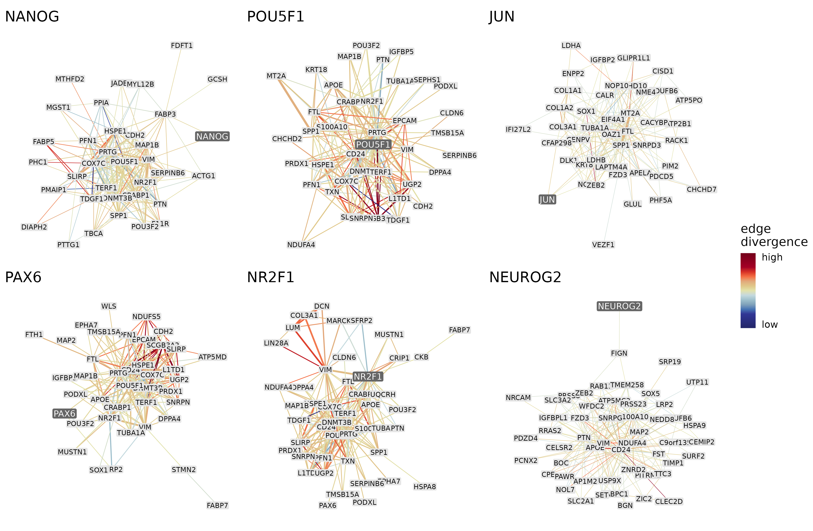

<style>
img {
  border: 0;
}
p.caption {
  font-size: 0.9em;
  width: 85%;
  margin: auto;
}
h1.title {
  font-size: 30px;
}
h1 { /* Header 1 */
  font-size: 24px;
}
h2 { /* Header 2 */
  font-size: 18px;
}
</style>

```{r, include = FALSE}
knitr::opts_chunk$set(
  eval = FALSE,
  collapse = TRUE,
  comment = "#>",
  meassage = FALSE,
  error = FALSE,
  warning = FALSE
)
```

```{r setup, echo = FALSE, eval = TRUE, results = 'hide', message = FALSE}
library(CroCoNet)
library(kableExtra)
library(dplyr)
library(ggplot2)
library(igraph)
```

**<tt>CroCoNet</tt>** (**Cro**ss-species **Co**mparison of **Net**works) is a computational pipeline and R package to quantitatively compare gene-regulatory networks across species. In this vignette, we present the workflow step by step, exemplified by an scRNA-seq dataset of early primate neural differentiation. The corresponding data files can be found at the following Zenodo repository:
<br>
<br>

# Input data

## Experimental design

<tt>CroCoNet</tt> can be applied to scRNA-seq data with multiple species and multiple replicates (clones) per species.

The example dataset contains 3 species: human, gorilla and cynomolgus macaque with 3 human clones from 3 individuals (H1c1, H2c1, and H3c1), 2 gorilla clones from 1 individual (G1c1, and G1c2) and 4 cynomolgus macaque clones from 2 individuals (C1c1, C1c2, C2c1 and C2c2). 

At several steps in the pipeline, the clones need to be matched to species. To make this possible, a data frame has to be created that specifies which species each clone belongs to.

```{r load_clone2species}
clone2species <- readRDS("RDS/clone2species.rds")
```

```{r echo = FALSE, eval = TRUE}
clone2species %>% 
  kbl() %>% 
  kable_styling()
```

To reliably infer networks, the dataset should have sufficient expression variance across cells (several different conditions, time-series experiment over a dynamic process or a mixture of cell types). For a meaningful analysis, the conditions, pseudotemporal trajectory and cell type composition should be as comparable across species as possible.

In case of the example dataset, all iPS cell lines were differentiated into neural progenitor cells (NPCs) over the course of 9 days, and samples were taken at 6 different time points. Based on the inferred pseudotime and cell type annotation, the differentiation trajectories are well-aligned across the 3 species.

```{r trajectory_plots, eval = TRUE, include = TRUE, echo = FALSE, out.width = "90%", fig.align = 'center', fig.cap = 'Pseudotime trajectory of the early primate neural differentiation dataset coloured by sampling day, pseudotime, species and cell type. The differentiation process is comparable across the 3 species.'}
knitr::include_graphics("trajectory.png")
```


## Initial processing

The pipeline assumes that the user has already done the standard processing steps on the transcriptomic data, including mapping, QC and normalization. In addition, it is required to have a shared feature space across all species. The genes can be matched using orthology information or in case of closely related species by transferring the annotation of one species to the genomes of others using the tool *Liftoff* @Shumate2021-ne. It is also recommended to perform cell type annotation and pseudotime inference if applicable. After these steps, a SingleCellExperiment (SCE) object should be created that contains the raw counts, normalized counts and metadata (including information on species, clone, cell type assignment and inferred pseudotime). 

In case of the primate single-cell dataset, we created a shared feature space by transferring the human genome annotation to the gorGor6 and macFas6 genomes via *Liftoff*. We performed the nornalization using <tt>scran</tt> @Lun2016-lx, pseudotime inference using <tt>SCORPIUS</tt> @Cannoodt2016-hn and cell type annotation using <tt>singleR</tt> @Aran2019-jl with the embryoid body dataset from Rhodes et al. @Rhodes2022-os as the reference. 

<!-- At the beginning, colors for species and cell types can also be defined: -->

<!-- ```{r load_basic_objects} -->
<!-- spec_colors <- setNames(c("#4DAF4A", "#377EB8", "#9a1ebd"),  -->
<!--                         c("human", "gorilla", "cynomolgus")) -->

<!-- ct_colors <- setNames(c("#86C1E6", "#F4AB62", "#CA6102"),  -->
<!--                       c("Pluripotent_Cells", "Early_Ectoderm",  "Neurons")) -->
<!-- ``` -->

## Network inference

Before applying the pipeline, the user also has to infer co-expression networks per clone using a method of choice, for example *GRNBoost2* @Moerman2019-xh (metric: decision tree-based importance scores) or *correlatePairs* @Lun2016-lx (metric: Spearman's correlation). The networks should not be restricted to connections between transcriptional regulators and their target genes, because <tt>CroCoNet</tt> relies also on connections between the target genes themselves. 

If the clones have very different cell type compositions, it is recommended to downsample them in a way that the proprtions of the cell types are always the same, in order to disentangle the species and cell type differences. It can make sense to create several downsamplings of each clone and run the network inference on each of them, this way useful data is not discarded.

If the network inference algorithm involving stochastic steps (this is the case e.g. for GRNBoost2), it can make the results more robust to run the algorithm several times on the same data with different random seeds.

The network reconstructions should be available as TSV files where each row corresponds to an edge. There should be at least 3 columns containing 1) the 1st gene that forms the edge, 2) the 2nd gene that forms the edge, and 3) the edge weight. The TSV files should be named using the following convention: *nameOfClone.tsv* if there is only 1 network output per clone or *nameOfClone_index.tsv* if there are several network outputs per clone.

In case of example dataset, we inferred networks using GRNBoost2 with all genes as potential regulators. We run the algorithm 10 times on the count matrix of each clones, which produced 9×10 TSV files stored in the directory <tt>GRNBoost2_output/</tt>.
<br>
<br>

# Loading and processing the networks

## Loading the networks as igraphs

As the first step, the TSV files containing the network reconstructions are loaded and summarized as a list of <tt>igraph</tt> @Csardi2006-sy objects per clone with the help of the <tt>loadNetworks</tt> function.

If there are several network reconstructions per clone due to different subsamplings/runs, the edge weights are averaged across these, and a single combined <tt>igraph</tt> object is returned. The number of subsamplings/runs has to be specified by the parameter <tt>rep</tt>. If the network inference method produces an output with directed edges, i.e. geneA-geneB and geneB-geneA can both be present, the edge weights inferred between the same gene pair but in opposite directions are also averaged. Whether the edges are directed or not, has to be specified by the parameter <tt>directed</tt>. If an edge is missing in one of the network versions/directions, it is regarded as 0 for the calculation of the mean.

Rarely occurring edges can be removed altogether by specifying <tt>min_occurrence</tt>. This is not relevant if the network inference was done only once per clone (<tt>rep</tt> = 1), therefore in this case the value of <tt>min_occurrence</tt> is ignored. If the network inference was done several times for each clone (<tt>rep</tt> > 1), the highest possible number of occurrences for each edge is 2×<tt>rep</tt> in case of a directed network inference method and <tt>rep</tt> in case of an undirected network inference method. If an edge occurs less often than the specified value of <tt>min_occurrence</tt>, the edge is removed. This can be helpful to 1) denoise the networks and 2) decrease the computational power needed for the next steps.

In case of the example dataset, the 9×10 TSV files located in the "GRNBoost2_output/" directory are loaded as a list of 9 <tt>igraph</tt> objects (1 network reconstruction for each of the 9 clones). The parameter <tt>rep</tt> is set to 10 as GRNBoost2 has been run 10 times on each clone, and the parameter <tt>directed</tt> is left at TRUE (the default), as GRNBoost2 produces a directed output. As a result, the edge weights are averaged across the 10 runs and 2 directions for each edge. Since the parameter <tt>min_occurrece</tt> is left at 2 (the default), edges that occur only once across all runs and directions are removed.

```{r load_networks}
network_list_raw <- loadNetworks("GRNBoost2_output/", 
                                 clone_names = clone2species$clone,
                                 rep = 10)
```

The resulting igraph objects store the edge weight and number of occurrences for each edge:

```{r glimpse_at_networks, eval = TRUE, echo = FALSE}
readRDS("network_list_raw_sample.rds") %>% 
  kbl(row.names = FALSE, caption = "A few example edges from the raw network of the clone C2c2", align=rep('c', 4)) %>% 
  kable_styling()
```


## Removing gene pairs with overlapping annotations

Mapping and counting is problematic for overlapping genomic features: parts of the reads from one gene can be assigned to the other gene, leading to correlated expression profiles simply due to genomic position. This has only a marginal effect on the results of a DE analysis, but can cause false positive edges with very high edge weights in case of a network analysis. Such potential artefacts can be circumvented by removing all edges between genes that have overlapping annotations in the genome(s) of at least 1 species.

To do this, the genome annotations are needed in a list format:

```{r load_GTFs}
gtf_list <- list(human = plyranges::read_gff("genome_annotations/hg38.gtf"),
                 gorilla = plyranges::read_gff("genome_annotations/gorGor6_liftoff.gtf"),
                 cynomolgus = plyranges::read_gff("genome_annotations/macFas6_liftoff.gtf"))
```

Then the function <tt>removeOverlappingGenePairs</tt> determines the genomic positions of the network genes based on the GTFs, identifies gene pairs with overlapping annotations in each genome and removed these gene pairs from all networks:

```{r remove_overlapping_gene_pairs}
network_list_raw_filt <- removeOverlappingGenePairs(network_list_raw, 
                                                    gtf_list = gtf_list, 
                                                    clone2species = clone2species, 
                                                    gene_col = "gene_name")
```

During this step, the genomic distance is also added for each gene pair of the network (the distance is regarded as Inf if the two genes are located on different chromosomes):

```{r glimpse_at_networks2, eval = TRUE, echo = FALSE}
readRDS("network_list_raw_filt_sample.rds") %>% 
  kbl(row.names = FALSE, caption = "A few example edges from the network of the clone C2c2 after removing gene pairs with overlapping annotation and adding genomic distances", align=rep('c', 5)) %>% 
  kable_styling()
```

## Normalizing edge weights

Normalizing the edge weights between 0 and 1 is recommended, because it makes them interpretable as adjacencies and ensures that network concepts such as connectivity are applicable.

There are 2 approaches for the normalization implemented as part of the <tt>nornmalizeEdgeWeights</tt> function:

* **Unsigned network** (default): Gene pairs with high negative edge weights are considered as connected as gene pairs with high positive edge weights. Therefore the negative edge weights are first replaced by their absolute values, then all edge weights are scaled by the maximum weight across all networks: 
$$a =  \frac{|w|}{max(|w|)}$$
where $a$ is the edge weight (adjacency) after normalization and $w$ is the edge weight before normalization.
After the transformation, the adjacencies around 0 correspond to the former low positive and low negative values, while the adjacencies around 1 correspond to the former high positive and high negative values.

* **Signed network**: Gene pairs with high negative edge weights are considered unconnected. Therefore all edge weights are transformed between 0 and 1 using a min-max normalization: 
$$a = \frac{w - min(w)}{max(w) - min(w)}$$
After the transformation, the adjacencies around 0 correspond to the former high negative values and the adjacencies around 1 correspond to the former high positive values.

In case of the example dataset, we opted for an unsigned network:

```{r normalize_edge_weights}
network_list <- normalizeEdgeWeights(network_list_raw_filt,
                                     signed = FALSE)
```

```{r glimpse_at_networks3, eval = TRUE, echo = FALSE}
readRDS("network_list_sample.rds") %>% 
  kbl(row.names = FALSE, caption = "A few example edges from the network of the clone C2c2 after normalizing edge weights", align=rep('c', 5)) %>% 
  kable_styling()
```

Using the resulting adjacencies, we also calculated the connectivity ($k_i$) of each gene, which is the sum of adjacencies between the given gene and all others:

$$k_i = \sum_{j \neq i} a_{ij}$$
Both the adjacencies and connectivites have a highly left-skewed distribution (the adjacencies range between 0 and 1, with a median of 0.000213, while the connectivities range between 0 and ~17, with a median of 0.256):

```{r adj_con_distr, eval = TRUE, include = TRUE, echo = FALSE, out.width = "80%", fig.align = 'center', fig.cap = 'The distribution od adjacencies and connectivities for the networks of the 9 clones.'}
knitr::include_graphics("edge_weight_con_distr.png")
```

## Creating the consensus network

As the next step of the workflow, the networks across different clones and different species are integrated into a single consensus network in a phylogeny-aware manner.

This consensus network contains all edges that were detected in at least 1 of the clones. For each edge, the consensus adjacency is calculated as the weighted mean of clonewise adjacencies. The weighted mean corrects for 1) the phylogenetic distances between species (if the phylogenetic tree is provided) and 2) the different numbers of clones per species. As a result, the approach downweighs the edge weights of the clones that 1) belong to closely related species or 2) belong to species with many clones, so that an imbalanced sampling across the phylogenetic tree does not bias the consensus network. If an edge is not present in one of the clones, the edge weight in that clone is regarded as 0 for the calculation of the weighted mean.

If a phylogeny-aware consensus is desired, the phylogenetic tree has to be provided. In case of the example dataset, this is the mammalian tree from Bininda-Emonds et al. @Bininda-Emonds2007-of subsetted for Homo sapiens (human), Gorilla gorilla (gorilla) and Macaca Fascicularis (cynomolgus):

```{r load_tree}
tree <- readRDS("RDS/tree.rds")
```

```{r phylogeny, eval = TRUE, include = TRUE, echo = FALSE, out.width = "28%", fig.align = 'center', fig.cap = 'Phylogenetic tree of the species.'}
knitr::include_graphics("tree.png")
```

Using the tree and the information which species each clone belongs to, the consensus network can be calculated with the help of the function <tt>createConsensus</tt>:

```{r create_consensus} 
consensus_network <- createConsensus(network_list, 
                                     clone2species = clone2species, 
                                     tree = tree)
```

```{r glimpse_at_consensus, eval = TRUE, echo = FALSE}
readRDS("consensus_network_sample.rds") %>% 
  kbl(row.names = FALSE, caption = "A few example edges from the consensus network", align=rep('c', 5)) %>% 
  kable_styling()
```

## Adding the direction of regulation

In case the networks were inferred using a method that does not distinguish coexpressed and anti-coexpressed gene pairs, it is useful to add this information for lines of analysis where it makes sense to separate the two (e.g. it makes biological sense to calculate the eigengenes for the activated and repressed target genes of a transcriptional regulator separately). If the network inference method output edges with both positive and negative edge weights in the first place (e.g. correlation-based methods), this information is already added during the step "Normalizing edge weights" and does not have to be calculated again.

If the step does need to be performed, the directionality is determined for each edge by calculating a modified Spearman's correlation between the expression profiles of the 2 genes that form the edge and taking the sign of the modified Spearman's rho as the direction. If rho is positive, the 2 genes are co-expressed, if rho is negative (*Note:* Here the directionality of a geneA-geneB edge refers to the characteristic whether geneA and geneB are coexpressed or anti-coexpressed and NOT whether geneA regulates geneB or geneB regulates geneA. The network remains undirected in a graph theoretical sense.)

In case of the example dataset, the networks were inferred using GRNBoost2 which does not provide information about the direction of regulation, therefore it is necessary to do this step. To get the expression profiles of the network genes, the SCE object needs to be loaded:

```{r load_sce}
sce <- readRDS("RDS/sce.rds")
```

The calculation of directionality is done by the function <tt>addDirectionality</tt> that relies on the approximate version of the Spearman's rho, significance testing and blocking implemented by <tt>correlatePairs</tt> @Lun2016-lx:

```{r add_direction_of_regulation}
consensus_network <- addDirectionality(consensus_network, sce)
```

```{r glimpse_at_consensus2, eval = TRUE, echo = FALSE}
readRDS("consensus_network_withDir_sample.rds") %>% 
  kbl(row.names = FALSE, caption = "A few example edges from the consensus network after adding the direction of regulation", align=rep('c', 8)) %>% 
  kable_styling()
```

<br>
<br>

# Module assignment

Once the consensus network is calculated, it can be used to assign co-expression modules jointly for all species. The resulting modules combine co-expression information from all species but the bias due to an uneven sampling across the phylogenetic tree is minimized. The center of each module is a transcriptional regulator and the modules are assigned in 2 main steps: 1) large initial modules are created by selecting a fixed number of target genes per regulator, and 2) the initial modules are pruned to keep only the best targets of each regulator. 

## Selecting key transcriptional regulators

First, the transcriptional regulators that form the cores of the co-expression modules have to be selected. To identify regulators that are relevant for the biological process at hand, it is a useful approach to combine prior biological knowledge with information from the dataset (this is implemented by the function <tt>getRegulators</tt>).

As for the prior biological knowledge, we recommend to select only transcriptional regulators with known binding motifs based on motif databases. To get this information, the user can choose the following databases: JASPAR 2024 vertebrate core @Rauluseviciute2023-dz, JASPAR 2024 unvalidated @Rauluseviciute2023-dz, the IMAGE database @Madsen2018-gq, or any combination of the above. Alternatively, the user can provide a custom list of regulators selected by their preferred method.

As for the information from the dataset, we recommend to select only transcriptional regulators that are among the highly variable genes in the data. For defining highly variable genes, <tt>getRegulators</tt> relies on <tt>scran::getTopHVGs</tt> @Lun2016-lx. Briefly, for each species a trend is fitted between the variance and mean of the log-expression values across all genes, and the fitted value of a gene is regarded as the technical component of variation, while the residual from the trend is regarded as the biological component of variation. All genes with a positive biological component are selected as highly variable genes in each species (alternatively, a more stringent variance cutoff, an adjusted p-value cutoff, a fixed number of genes, or a fixed percentage of genes can also be defined). As the final set of highly variable genes, the union of highly variable genes is taken across species.

In case of the example dataset, we used transcriptional regulators that 1) had an annotated motif in any of the 3 motif databases (JASPAR 2024 vertebrate core, JASPAR 2024 unvalidated and IMAGE) and 2) had a positive biological component of variance in any of the species throughout the neural differentiation process:

```{r get_regulators}
regulators <- getRegulators(sce, 
                            source = c("jaspar_core", "jaspar_unvalidated", "image"))
```

```{r echo = FALSE, eval = TRUE}
regulators <- readRDS("regulators.rds")
```

This gave us 836 transcriptional regulators that included well-known pluripotency factors and early neural regulators:

```{r, eval = TRUE, results = 'asis'}
length(regulators)
```

```{r, eval = TRUE, results = 'asis'}
c("NANOG", "POU5F1", "JUN", "PAX6", "NR2F1", "NEUROG2") %in% regulators
```


## Assigning initial modules

Once the regulators that provide the starting point of the module assignment are selected, an initial module can be defined around each of them using the function <tt>assignInitialModules</tt>. Each of these modules contain the regulator and its N best target genes (N is recommended to be between 1000 and 5000). When choosing the best targets, the genes are ranked based on how strongly they are connected to the regulator (regulator-target adjacency).

In case of the example dataset, we defined 4000 as the number of genes in the initial modules:

```{r initial_modules}
initial_modules <- assignInitialModules(consensus_network, 
                                        regulators = regulators, 
                                        N = 4000)
```

```{r glimpse_at_initial_modules, eval = TRUE, echo = FALSE}
readRDS("initial_modules_sample.rds") %>% 
  kbl(row.names = FALSE, caption = "Part of the POU5F1 initial module", align=rep('c', 8)) %>% 
  kable_styling() %>% 
  column_spec(5, "3cm")
```

The resulting modules are obviously too large at this point to be biologically meaningful. The purpose of this step is rather to select a uniformly sized pool of genes for all modules to perform the pruning step on.


## Module pruning

Prunes the initial modules by keeping only the best targets of each transcriptional regulator.

What a good target is can be defined based on 2 metrics:

```{r adj_regulator_kIM, eval = TRUE, include = TRUE, echo = FALSE, out.width = "60%", fig.align = 'center', fig.cap = 'Network concepts used for module pruning: regulator-target adjacency and intramodular connectivity.'}
knitr::include_graphics("adj_regulator_kIM.png")
```

* **Regulator-target adjacency**: The adjacency between a transcriptional regulator and a member gene in its module, measures how strongly the target gene is controlled by the regulator. It ranges between 0 and 1 with a higher value representing a stronger (activating or repressing) regulatory relationship.

  * *Pro*: Pruning based on the regulator-target adjacencies select the genes whose expression profiles co-vary the most with the regulator's expression profile.

  * *Con*: Modules created based on the regulator-target adjacencies alone might not fulfill the expectation of being densely connected blocks of genes, apart from the link to the regulator, the target genes often only have sparse/weak connections within the module.

* **Intramodular connectivity**: The sum of adjacencies between a specific gene and all other members of the module, measures how strongly the gene is connected overall to the rest of the module. If the module size is *n*, it ranges between 0 and *n* - 1 with a higher value representing a gene that is more embedded in its module.
$$kIM_i^{(q)} = \sum_{\substack{j \in q\\j \neq i}} a_{ij}$$

  * *Pro*: Pruning based on intramodular connectivities in addition to the regulator-target adjacencies ensures that the chosen targets co-vary not just with the main regulator but also with the rest of the module. These intramodular connections between targets can carry important information that are not captured by the links between regulator and targets alone (e.g. combinatorial regulation).

  * *Con*: Genes that have a generally high connectivity but do not have a particularly strong regulatory relationship with the transcriptional regulator might end up in the final module.

The initial targets can be filtered based on these metrics using 2 approaches:

* **topN**: Keeps a fixed number of targets (default: 50) per regulator.

  * *Pro*: Quick, simple and widespread. As opposed to clustering-based module assignment methods, the modules are allowed to overlap, and in addition to having its own module, a regulator can be assigned to another regulator's module as well, in line with the notion that genes can fulfill several different functions in the cell and gene regulation can be combinatorial.

  * *Con*: The approach assigns the same number of target genes to each regulator even though biologically speaking different regulators can have an effect on different numbers of genes. The number of targets is in most cases arbitrary and does not taking into account the structure of the data at hand.

* **UIK**: Applies dynamic stepwise pruning using knee-point detection. In each step, the cumulative sum curve based on the metric of choice is calculated per module, the knee point of the curve is identified using the Unit Invariant Knee (UIK) method, then only the targets that rank higher than the knee point are kept. The modules containing less target genes than a minimum module size (default: 20) are removed after each pruning step. The steps continue until the percentage of removed modules becomes higher than tolerance threshold (default: 2%).

  * *Pro*: While setting a minimum module size prevents the modules from becoming too small, the exact number of target genes per regulator does not have to be pre-defined, in line with the notion that different regulators can have an effect on different numbers of genes. There are also no hard cutoffs applied to the regulator-target adjacencies or intramodular connectivities, but by using knee point detection the target genes are filtered in a data-driven way. As opposed to clustering-based module assignment methods, the modules are allowed to overlap, and in addition to having its own module, a regulator can be assigned to another regulator's module as well, in line with the notion that genes can fulfill several different functions in the cell and gene regulation can be combinatorial.

  * *Con*: The approach still requires a predefined minimum module size. Apart from biological priors, technical aspects also have to be taken into consideration when setting this cutoff: for modules smaller than ~20 genes, the correlation-based preservation statistics in the next steps might be coupled with high uncertainty.

Using the metrics and approaches described above, we implemented 3 methods for module pruning:

* **topN**: Takes a fixed number of targets per regulator with the highest regulator-target adjacencies.

* **UIK_adj**: Applies a dynamic stepwise pruning based on the regulator-target adjacencies.

* **UIK_adj_kIM**: Applies a dynamic stepwise pruning based on the regulator-target adjacencies and intramodular connectivities alternately.

In case of the example dataset, we used the method "UIK_adj_kIM":

```{r pruned_modules}
pruned_modules <- pruneModules(initial_modules, 
                               method = "UIK_adj_kIM", 
                               consensus_network = consensus_network)
```

The following figure shows the steps of the pruning process for the POU5F1 module:

```{r POU5F1_mod_pruning, eval = TRUE, include = TRUE, echo = FALSE, out.width = "45%", fig.align = 'center', fig.cap = 'Stepwise dynamic pruning approach exemplified by the POU5F1 module. In each step, we calculated the cumulative sum curve of the regulator-target adjacency or intramodular connectivitiy of the target genes alternately, then kept the targets that fell below the knee point of the curve. We continued this process for 3 iterations - until the module sizes became as small as possible without falling below 20 genes.'}
knitr::include_graphics("POU5F1_detailed_UIK_adj_kIM.png")
```

```{r glimpse_at_pruned_modules, eval = TRUE, echo = FALSE}
readRDS("pruned_modules_sample.rds") %>% 
  kbl(row.names = FALSE, caption = "Part of the POU5F1 pruned module", align=rep('c', 9)) %>% 
  kable_styling(font_size = 13.1) %>% 
  column_spec(5, "2.5cm")
```

Since we use the "UIK_adj_kIM" approach, the final module sizes are not predefined but shaped by the data. For this particular dataset, the number of genes in the pruned modules range from 25 to 63 with a median of 45:

```{r module_size_distr, eval = TRUE, include = TRUE, echo = FALSE, out.width = "60%", fig.align = 'center', fig.cap = 'Distribution of module sizes after pruning. Median size: 45.'}
knitr::include_graphics("module_size_distribution.png")
```

The most important connections of the modules can be plotted using the function <tt>plotNetworks</tt>. For each module, the resulting plots show the top N (by default top 200) strongest intramodular connections based on the consensus network and the genes involved in these connections. For each of these edges, an edge divergence score is calculated based on its edge weights in the networks of individual clones. The edge weights are compared across species using an ANOVA, and the F-statistic (i.e. between-species variability / within-species variability) is regarded as the measure of edge divergence and used to color the edges on the plot:

```{r plot_modules}
example_modules <- c("NANOG", "POU5F1", "JUN", "PAX6", "NR2F1", "NEUROG2")
plotNetworks(example_modules, 
             pruned_modules, 
             consensus_network, 
             network_list, 
             clone2species)
```

```{r network_examples, eval = TRUE, include = TRUE, echo = FALSE, out.width = "90%", fig.align = 'center', fig.cap = 'The 200 strongest connections of 6 example modules. The thickness of the edges represents the consensus edge weights and the color of the edges represents how different the mean edge weights are across the 3 species.'}

```

## Creating random modules

Along with the pruned modules, there is an option to create random modules as well using the function <tt>createRandomModules</tt>. The random modules have the same regulators and contain the same number of target genes as the actual pruned modules, but these target genes are randomly drawn from all network genes.

```{r random_modules}
genes <- rownames(sce)
random_modules <- createRandomModules(pruned_modules, 
                                      network_genes = genes)
```

In the next steps of the pipeline, the actual modules are compared to these random modules in terms of the statistics calculated to check whether the two groups of modules behave in general differently and to remove those individual actual modules that show too similar characteristics to the random modules.

## Calculating module eigengenes

```{r eigengenes}
eigengenes <- calculateEigengenes(regulators,
                                  pruned_modules, 
                                  sce)
```

```{r plot_eigengenes}
eigengenes_filt <- eigengenes %>%
  dplyr::filter(module %in% paste0(example_modules, "(+)")) %>%
  dplyr::mutate(module = factor(module, paste0(example_modules, "(+)")))
plotEigengeneHeatmap(eigengenes_filt)
```
<br>
<br>

# Module preservation within and across species

## Calculating module preservation statistics

```{r pres_stats}
pres_stats_jk <- calculatePresStats(pruned_modules, 
                                    network_list,
                                    "cor_kIM", 
                                    clone2species)
random_pres_stats_jk <- calculatePresStats(random_modules, 
                                           network_list,
                                           "cor_kIM", 
                                           clone2species)
```
<br>
<br>

# References
