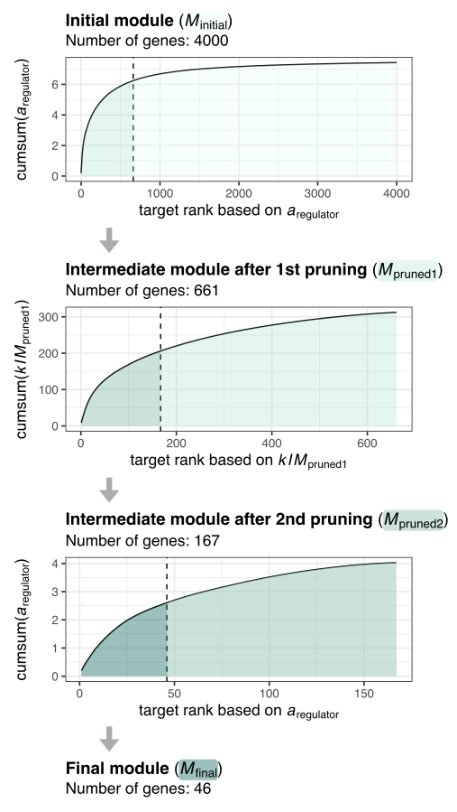
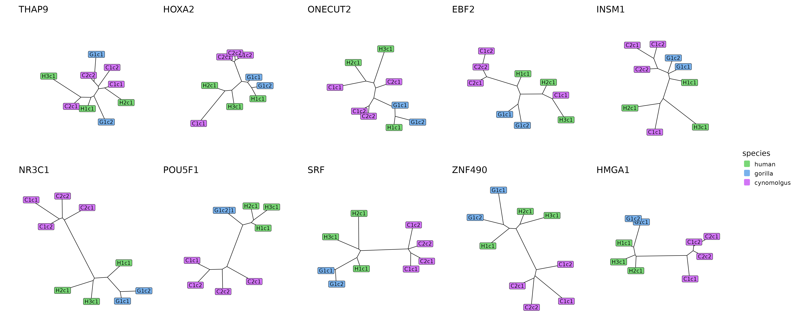
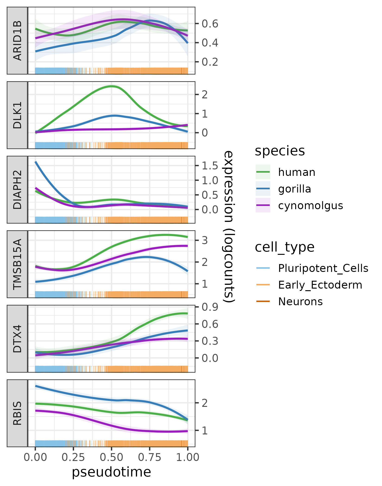

<style>
img {
  border: 0;
}
p.caption {
  font-size: 0.95em;
  width: 85%;
  margin: auto;
}

h1.title {
  font-size: 30px;
}
h1 { /* Header 1 */
  font-size: 24px;
}
h2 { /* Header 2 */
  font-size: 18px;
}
body {
text-align: justify
}

.template-article .contents h2 { font-size: 1.75rem; }  /* top-level section */
.template-article .contents h3 { font-size: 1.35rem; }  /* subsections */

</style>

```{r, include = FALSE}
knitr::opts_chunk$set(
  eval = FALSE,
  collapse = TRUE,
  comment = "#>",
  message = FALSE,
  error = FALSE,
  warning = FALSE
)
```

```{r setup, echo = FALSE, eval = TRUE, results = 'hide', message = FALSE}
library(CroCoNet)
library(kableExtra)
library(dplyr)
library(ggplot2)
library(igraph)
library(clusterProfiler)
```

<tt>CroCoNet</tt> (**Cro**ss-species **Co**mparison of **Net**works) is a computational pipeline and R package to quantitatively compare gene-regulatory networks across species. In this vignette, we present the workflow step by step, exemplified by an scRNA-seq dataset of early primate neural differentiation. The corresponding data files can be found at the following Zenodo repository:
<br>
<br>

# Input data

## Experimental design

<tt>CroCoNet</tt> was designed to be used on scRNA-seq data with multiple species and multiple replicates (clones) per species. To reliably infer networks, the dataset should have sufficient expression variance across cells (several different conditions, time-series experiment over a dynamic process or a mixture of cell types). For a meaningful analysis, the conditions, pseudotemporal trajectory and cell type composition should be as comparable across species as possible.

The example dataset contains 3 species: human, gorilla and cynomolgus macaque with 3 human clones from 3 individuals (H1c1, H2c1, and H3c1), 2 gorilla clones from 1 individual (G1c1, and G1c2) and 4 cynomolgus macaque clones from 2 individuals (C1c1, C1c2, C2c1 and C2c2). 

At several steps in the pipeline, the clones need to be matched to species. To make this possible, a data frame <tt>clone2species</tt> has to be created that specifies which species each clone belongs to. How this looks like for the example data is shown below:

```{r load_clone2species}
clone2species <- readRDS("RDS/clone2species.rds")
```

```{r echo = FALSE, eval = TRUE}
clone2species %>% 
  kbl(row.names = FALSE) %>% 
  kable_styling(font_size = 13)
```

To generate the example data, all of these 9 iPS cell lines were differentiated into neural progenitor cells (NPCs) over the course of 9 days, and samples from 6 different time points were sequenced using scRNA-seq. The protocol and the timeline were the same for all species to make the results comparable.

## Initial processing

The pipeline assumes that the user has already done the standard processing steps on the transcriptomic data, including mapping, QC and normalization. In addition, it is required to have a shared feature space across all species. The genes can be matched using orthology information or in case of closely related species by transferring the annotation of one species to the genomes of others using the tool *Liftoff* @Shumate2021-ne. It is also recommended to perform cell type annotation and pseudotime inference if applicable. After these steps, a SingleCellExperiment (SCE) object should be created that contains the raw counts, normalized counts and metadata (including information on species, clone, cell type assignment and inferred pseudotime). 

In case of the primate single-cell dataset, we created a shared feature space by transferring the human genome annotation to the gorGor6 and macFas6 genomes via *Liftoff*. We performed the nornalization using <tt>scran</tt> @Lun2016-lx, pseudotime inference using <tt>SCORPIUS</tt> @Cannoodt2016-hn and cell type annotation using <tt>singleR</tt> @Aran2019-jl with the embryoid body dataset from Rhodes et al. @Rhodes2022-os as the reference. We found that the pseudotime trajectories are reasonably well-aligned across the 3 species, confirming comparability.

```{r trajectory_plots, eval = TRUE, include = TRUE, echo = FALSE, out.width = "90%", fig.align = 'center', fig.cap = 'Pseudotime trajectory of the early primate neural differentiation dataset coloured by sampling day, pseudotime, species and cell type.'}
knitr::include_graphics("trajectory.png")
```

<!-- At the beginning, colors for species and cell types can also be defined: -->

<!-- ```{r load_basic_objects} -->
<!-- spec_colors <- setNames(c("#4DAF4A", "#377EB8", "#9a1ebd"),  -->
<!--                         c("human", "gorilla", "cynomolgus")) -->

<!-- ct_colors <- setNames(c("#86C1E6", "#F4AB62", "#CA6102"),  -->
<!--                       c("Pluripotent_Cells", "Early_Ectoderm",  "Neurons")) -->
<!-- ``` -->

## Network inference

Before applying the pipeline, the user also has to infer co-expression networks per clone using a method of choice, for example *GRNBoost2* @Moerman2019-xh (metric: decision tree-based importance scores) or *correlatePairs* @Lun2016-lx (metric: Spearman's correlation). The networks should not be restricted to connections between transcriptional regulators and their target genes, because <tt>CroCoNet</tt> relies also on connections between the target genes themselves. 

If the clones have very different cell type compositions, it is recommended to downsample them in a way that the proprtions of the cell types are always the same, in order to disentangle the species and cell type differences. It can make sense to create several downsamplings of each clone and run the network inference on each of them, this way valuable data is not discarded.

If the network inference algorithm involving stochastic steps (this is the case e.g. for GRNBoost2), it can make the results more robust to run the algorithm several times on the same data with different random seeds.

The network reconstructions should be available as TSV files where each row corresponds to an edge. There should be at least 3 columns containing 1) the 1st gene that forms the edge, 2) the 2nd gene that forms the edge, and 3) the edge weight. The TSV files should be named using the following convention: *nameOfClone.tsv* if there is only 1 network output per clone or *nameOfClone_index.tsv* if there are several network outputs per clone.

In case of example dataset, we inferred networks using GRNBoost2 with all genes as potential regulators. We run the algorithm 10 times on the count matrix of each clones, which produced 9×10 TSV files stored in the directory <tt>GRNBoost2_output/</tt>.
<br>
<br>

# Loading and processing the networks

In the first part of the workflow, the output files of the network inference are loaded as <tt>igraph</tt> objects, the edges are filtered and the edge weights are normalized (if desired), and finally, a phylogeny-aware consensus network is calculated across all clones and species. If the network inference algorithm does not distinguish correlated and anti-correlated gene pairs, this piece of information can also be added by calculating a Spearman's correlation for each gene pair.

## Loading the networks as igraphs

As the first step, the TSV files containing the network reconstructions are loaded and summarized as a list of <tt>igraph</tt> @Csardi2006-sy objects per clone with the help of the <tt>loadNetworks</tt> function.

If there are several versions of network reconstruction per clone due to different subsamplings/runs (needs to be specified in parameter <tt>rep</tt>), the edge weights are averaged across these, and a single combined <tt>igraph</tt> object is returned for each clone. If the network inference method produces an output with directed edges, i.e. geneA-geneB and geneB-geneA can both be present (needs to be specified in parameter <tt>directed</tt>), the edge weights inferred between the same gene pair but in opposite directions are also averaged. If an edge is missing in one of the network versions/directions, it is regarded as 0 for the calculation of the mean. The number of times an edge occurs across the different versions and directions can also be used as a filter and rare edges can be removed altogether (needs to be specified in parameter <tt>min_occurrence</tt>). This can be helpful to 1) denoise the networks and 2) decrease the computational power needed for the next steps.

In case of the example dataset, the 9×10 TSV files located in the "GRNBoost2_output/" directory are loaded as a list of 9 <tt>igraph</tt> objects (1 network reconstruction for each of the 9 clones). The parameter <tt>rep</tt> is set to 10 as GRNBoost2 has been run 10 times on each clone, and the parameter <tt>directed</tt> is left at TRUE (the default), as GRNBoost2 produces a directed output. As a result, the edge weights are averaged across the 10 runs and 2 directions for each edge. Since the parameter <tt>min_occurrece</tt> is left at 2 (the default), edges that occur only once across all runs and directions are removed.

```{r load_networks}
network_list_raw <- loadNetworks("GRNBoost2_output/", 
                                 clone_names = clone2species$clone,
                                 rep = 10,
                                 directed = TRUE,
                                 min_occurrence = 2)
```

The resulting igraph objects store the edge weight and number of occurrences for each edge:

```{r glimpse_at_networks, eval = TRUE, echo = FALSE}
readRDS("network_list_raw_sample.rds") %>% 
  kbl(row.names = FALSE, caption = "<span style='font-size:13px'>A few example edges from the raw network of the clone C2c2</span>", align=rep('c', 4)) %>% 
  kable_styling(font_size = 13)
```


## Removing gene pairs with overlapping annotations

Mapping and counting is problematic for overlapping genomic features: parts of the reads from one gene can be assigned to the other gene, leading to correlated expression profiles simply due to genomic position. This has only a marginal effect on the results of a DE analysis, but can cause false positive edges with very high edge weights in case of a network analysis. Such potential artefacts can be circumvented by removing all edges between genes that have overlapping annotations in the genome(s) of at least 1 species.

To do this, the genome annotations are needed in a list format:

```{r load_GTFs}
gtf_list <- list(human = plyranges::read_gff("genome_annotations/hg38.gtf"),
                 gorilla = plyranges::read_gff("genome_annotations/gorGor6_liftoff.gtf"),
                 cynomolgus = plyranges::read_gff("genome_annotations/macFas6_liftoff.gtf"))
```

Then the function <tt>removeOverlappingGenePairs</tt> determines the genomic positions of the network genes based on the GTFs, identifies gene pairs with overlapping annotations in each genome and removed these gene pairs from all networks:

```{r remove_overlapping_gene_pairs}
network_list_raw_filt <- removeOverlappingGenePairs(network_list_raw, 
                                                    gtf_list = gtf_list, 
                                                    clone2species = clone2species, 
                                                    gene_col = "gene_name")
```

During this step, the genomic distance is also added for each gene pair of the network (the distance is regarded as Inf if the two genes are located on different chromosomes):

```{r glimpse_at_networks2, eval = TRUE, echo = FALSE}
readRDS("network_list_raw_filt_sample.rds") %>% 
  kbl(row.names = FALSE, caption = "<span style='font-size:13px'>A few example edges from the network of the clone C2c2 after removing gene pairs with overlapping annotation and adding genomic distances</span>", align=rep('c', 5)) %>% 
  kable_styling(font_size = 13)
```

## Normalizing edge weights

Normalizing the edge weights between 0 and 1 is recommended, because it makes them interpretable as adjacencies and ensures that network concepts such as connectivity are applicable.

There are 2 approaches for the normalization implemented as part of the <tt>nornmalizeEdgeWeights</tt> function:

* **Unsigned network** (default): Gene pairs with high negative edge weights are considered as connected as gene pairs with high positive edge weights. Therefore the negative edge weights are first replaced by their absolute values, then all edge weights are scaled by the maximum weight across all networks: 
$$a =  \frac{|w|}{max(|w|)}$$
where $a$ is the edge weight (adjacency) after normalization and $w$ is the edge weight before normalization.
After the transformation, the adjacencies around 0 correspond to the former low positive and low negative values, while the adjacencies around 1 correspond to the former high positive and high negative values.

* **Signed network**: Gene pairs with high negative edge weights are considered unconnected. Therefore all edge weights are transformed between 0 and 1 using a min-max normalization: 
$$a = \frac{w - min(w)}{max(w) - min(w)}$$
After the transformation, the adjacencies around 0 correspond to the former high negative values and the adjacencies around 1 correspond to the former high positive values.

In case of the example dataset, we opted for an unsigned network:

```{r normalize_edge_weights}
network_list <- normalizeEdgeWeights(network_list_raw_filt,
                                     signed = FALSE)
```

```{r glimpse_at_networks3, eval = TRUE, echo = FALSE}
readRDS("network_list_sample.rds") %>% 
  kbl(row.names = FALSE, caption = "<span style='font-size:13px'>A few example edges from the network of the clone C2c2 after normalizing edge weights</span>", align=rep('c', 5)) %>% 
  kable_styling(font_size = 13)
```

Using the resulting adjacencies, we also calculated the connectivity ($k_i$) of each gene, which is the sum of adjacencies between the given gene and all others:

$$k_i = \sum_{j \neq i} a_{ij}$$
Both the adjacencies and connectivites have a highly left-skewed distribution (the adjacencies range between 0 and 1, with a median of 0.000213, while the connectivities range between 0 and ~17, with a median of 0.256). This is expected since connectivities in many biological networks, including gene regulatory networks, have been reported to follow scale-free distribution [@Agrawal2002-tb; @Bergmann2003-sp; @Barabasi2004-gi] (although the extent of this varies across systems and metrics @Broido2019-tf).

```{r adj_con_distr, eval = TRUE, include = TRUE, echo = FALSE, out.width = "80%", fig.align = 'center', fig.cap = 'The distribution od adjacencies and connectivities for the networks of the 9 clones.'}
knitr::include_graphics("edge_weight_con_distr.png")
```

## Creating the consensus network

As the next step of the workflow, the networks across different clones and different species are integrated into a single consensus network in a phylogeny-aware manner.

This consensus network contains all edges that were detected in at least 1 of the clones. For each edge, the consensus adjacency is calculated as the weighted mean of clonewise adjacencies. The weighted mean corrects for 1) the phylogenetic distances between species, and 2) the different numbers of clones per species. As a result, the approach downweighs the edge weights of the clones that 1) belong to closely related species, or 2) belong to species with many clones, so that an imbalanced sampling across the phylogenetic tree does not bias the consensus network. If an edge is not present in one of the clones, the edge weight in that clone is regarded as 0 for the calculation of the weighted mean.

If a phylogeny-aware consensus is desired, the phylogenetic tree has to be provided. In case of the example dataset, this is the mammalian tree from Bininda-Emonds et al. @Bininda-Emonds2007-of subsetted for Homo sapiens (human), Gorilla gorilla (gorilla) and Macaca Fascicularis (cynomolgus):

```{r load_tree}
tree <- readRDS("RDS/tree.rds")
```

```{r phylogeny, eval = TRUE, include = TRUE, echo = FALSE, out.width = "28%", fig.align = 'center', fig.cap = 'Phylogenetic tree of the species.'}
knitr::include_graphics("tree.png")
```

Using the tree and the information which species each clone belongs to, the consensus network can be calculated with the help of the function <tt>createConsensus</tt>:

```{r create_consensus} 
consensus_network <- createConsensus(network_list, 
                                     clone2species = clone2species, 
                                     tree = tree)
```

```{r glimpse_at_consensus, eval = TRUE, echo = FALSE}
readRDS("consensus_network_sample.rds") %>% 
  kbl(row.names = FALSE, caption = "<span style='font-size:13px'>A few example edges from the consensus network</span>", align=rep('c', 5)) %>% 
  kable_styling(font_size = 13)
```

## Adding the direction of correlation

In case the networks were inferred using a method that does not distinguish positively and negatively correlated gene pairs, it is useful to add this information for lines of analysis where it makes sense to separate the two (e.g. it makes biological sense to calculate the eigengenes for the activated and repressed target genes of a transcriptional regulator separately). If the network inference method output edges with both positive and negative edge weights in the first place (e.g. correlation-based methods), this information is already added during the step "Normalizing edge weights" and does not have to be calculated again.

If the step does need to be performed, the directionality is determined for each edge by calculating a modified Spearman's correlation between the expression profiles of the 2 genes that form the edge and taking the sign of the modified Spearman's rho as the direction. The calculation relies on the approximate version of the Spearman's rho, significance testing and blocking implemented by <tt>correlatePairs</tt> @Lun2016-lx.

In case of the example dataset, the networks were inferred using GRNBoost2 which does not provide information about the direction of regulation, therefore it is necessary to do this step. To get the expression profiles of the network genes, the SCE object needs to be loaded:

```{r load_sce}
sce <- readRDS("RDS/sce.rds")
```

The calculation of directionality is done by the function <tt>addDirectionality</tt>:

```{r add_direction_of_regulation}
consensus_network <- addDirectionality(consensus_network, sce)
```

```{r glimpse_at_consensus2, eval = TRUE, echo = FALSE}
readRDS("consensus_network_withDir_sample.rds") %>% 
  kbl(row.names = FALSE, caption = "<span style='font-size:13px'>A few example edges from the consensus network after adding the direction of correlation</span>", align=rep('c', 8)) %>% 
  kable_styling(font_size = 13)
```

<br>
<br>

# Module assignment

Once the consensus network is calculated, it can be used to assign co-expression modules jointly for all species. The resulting modules combine co-expression information from all species but the bias due to an uneven sampling across the phylogenetic tree is minimized. The center of each module is a transcriptional regulator and the modules are assigned in 2 main steps: 1) large initial modules are created by selecting a fixed number of target genes per regulator, and 2) the initial modules are pruned to keep only the best targets of each regulator. 

## Selecting key transcriptional regulators

First, the transcriptional regulators that form the cores of the co-expression modules have to be selected. To identify regulators that are relevant for the biological process at hand, it is a useful approach to combine prior biological knowledge with information from the dataset (this is implemented by the function <tt>getRegulators</tt>).

As for the prior biological knowledge, we recommend to select only transcriptional regulators with known binding motifs based on motif databases. To get this information, the user can choose the following databases: JASPAR 2024 vertebrate core @Rauluseviciute2023-dz, JASPAR 2024 unvalidated @Rauluseviciute2023-dz, the IMAGE database @Madsen2018-gq, or any combination of the above. Alternatively, the user can provide a custom list of regulators selected by their preferred method.

As for the information from the dataset, we recommend to select only transcriptional regulators that are among the highly variable genes in the data. For defining highly variable genes, <tt>getRegulators</tt> relies on <tt>scran::getTopHVGs</tt> @Lun2016-lx. Briefly, for each species a trend is fitted between the variance and mean of the log-expression values across all genes, and the fitted value of a gene is regarded as the technical component of variation, while the residual from the trend is regarded as the biological component of variation. All genes with a positive biological component are selected as highly variable genes in each species (alternatively, a more stringent variance cutoff, an adjusted p-value cutoff, a fixed number of genes, or a fixed percentage of genes can also be defined). As the final set of highly variable genes, the union of highly variable genes is taken across species.

In case of the example dataset, we used transcriptional regulators that 1) had an annotated motif in any of the 3 motif databases (JASPAR 2024 vertebrate core, JASPAR 2024 unvalidated and IMAGE) and 2) had a positive biological component of variance in any of the species:

```{r get_regulators}
regulators <- getRegulators(sce, 
                            source = c("jaspar_core", "jaspar_unvalidated", "image"))
```

```{r echo = FALSE, eval = TRUE}
regulators <- readRDS("regulators.rds")
```

This gave us 836 transcriptional regulators that included well-known pluripotency factors and early neural regulators:

```{r, eval = TRUE, results = 'markup'}
length(regulators)
```

```{r, eval = TRUE, results = 'markup'}
c("NANOG", "POU5F1", "PAX6", "NEUROD4") %in% regulators
```


## Assigning initial modules

Once the regulators that provide the starting point of the module assignment are selected, an initial module can be defined around each of them using the function <tt>assignInitialModules</tt>. Each of these modules contain the regulator and its N best target genes (N is recommended to be between 1000 and 5000). When choosing the best targets, the genes are ranked based on how strongly they are connected to the regulator (regulator-target adjacency).

In case of the example dataset, we defined 4000 as the number of genes in the initial modules:

```{r initial_modules}
initial_modules <- assignInitialModules(consensus_network, 
                                        regulators = regulators, 
                                        N = 4000)
```

```{r glimpse_at_initial_modules, eval = TRUE, echo = FALSE}
readRDS("initial_modules_sample.rds") %>% 
  kbl(row.names = FALSE, caption = "<span style='font-size:13px'>Part of the POU5F1 initial module</span>", align=rep('c', 8)) %>% 
  kable_styling(font_size = 13) %>% 
  column_spec(5, "3cm")
```

The resulting modules are obviously too large at this point to be biologically meaningful. The purpose of this step is rather to select a uniformly sized pool of genes for all modules to perform the pruning step on.


## Module pruning

The goal of pruning is to keep only the best targets of each transcriptional regulator and thereby create biologically meaningful modules that consist of co-regulated genes with shared cellular functions.

Which targets are the best can be defined based on 2 metrics:

```{r adj_regulator_kIM, eval = TRUE, include = TRUE, echo = FALSE, out.width = "60%", fig.align = 'center', fig.cap = 'Network concepts used for module pruning: regulator-target adjacency and intramodular connectivity.'}
knitr::include_graphics("adj_regulator_kIM.png")
```

* **Regulator-target adjacency** ($a_{\mathrm{regulator}}$): The adjacency between a transcriptional regulator and a member gene in its module. It ranges between 0 and 1 with a higher value representing a stronger (activating or repressing) regulatory relationship.

  * *Pro*: Pruning based on the regulator-target adjacencies selects the genes whose expression profiles co-vary the most with the regulator's expression profile.

  * *Con*: Modules created based on the regulator-target adjacencies alone might not fulfill the expectation of being densely connected blocks of genes, apart from the link to the regulator, the target genes often only have sparse/weak connections within the module.

* **Intramodular connectivity** (*kIM*): The sum of adjacencies between a specific gene and all other members of the module. If the module size is *n*, it ranges between 0 and *n* - 1 with a higher value representing a gene that is more strongly connected to the rest of the module.
$$kIM_i^{(q)} = \sum_{\substack{j \in q\\j \neq i}} a_{ij}$$

  * *Pro*: Pruning based on intramodular connectivities in addition to the regulator-target adjacencies ensures that the chosen targets co-vary not just with the main regulator but also with the rest of the module. These intramodular connections between targets can carry important information that are not captured by the links between regulator and targets alone (e.g. combinatorial regulation).

  * *Con*: Genes that have a generally high connectivity but do not have a particularly strong regulatory relationship with the transcriptional regulator might end up in the final module.

The initial targets can be filtered based one or both of these metrics using 2 approaches:

* **topN**: Keeps a fixed number of targets (default: 50) per regulator.

  * *Pro*: Quick, simple and widespread.

  * *Con*: The approach assigns the same number of target genes to each regulator even though biologically speaking different regulators can have an effect on different numbers of genes. The number of targets is in most cases arbitrary and does not take into account the structure of the data at hand.

* **UIK**: Applies dynamic stepwise pruning using knee-point detection. In each step, the cumulative sum curve based on the metric of choice is calculated per module, the knee point of the curve is identified using the Unit Invariant Knee (UIK) method, then only the targets that rank higher than the knee point are kept. The modules containing less target genes than a minimum module size (default: 20) are removed after each pruning step. The steps continue until the percentage of removed modules becomes too high (default: >2%).

  * *Pro*: While setting a minimum module size prevents the modules from becoming too small, the exact number of target genes per regulator does not have to be pre-defined, in line with the notion that different regulators can have an effect on different numbers of genes. There are also no hard cutoffs applied to the regulator-target adjacencies or intramodular connectivities, but by using knee point detection the target genes are filtered in a data-driven way. 

  * *Con*: The approach still requires a predefined minimum module size.

Compared to clustering-based module assignment approaches, both pruning methods have the advantage that the modules are allowed to overlap, and in addition to having its own module, a regulator can be assigned to another regulator's module as well. This is in line with the notion that genes can fulfill several different functions in the cell and gene regulation can be combinatorial. 

In case of both pruning methods, when setting the fixed module size or the threshold for the minimum module size not just biological but also technical aspects have to be taken into consideration: for modules smaller than ~20 genes, the correlation-based preservation statistics in the next steps might be coupled with high uncertainty, therefore they should be avoided.

Using the metrics and approaches described above, we implemented 3 methods for module pruning:

* **topN**: Takes a fixed number of targets per regulator with the highest regulator-target adjacencies.

* **UIK_adj**: Applies a dynamic stepwise pruning based on the regulator-target adjacencies.

* **UIK_adj_kIM**: Applies a dynamic stepwise pruning based on the regulator-target adjacencies and intramodular connectivities alternately.

In case of the example dataset, we used the method "UIK_adj_kIM":

```{r pruned_modules}
pruned_modules <- pruneModules(initial_modules, 
                               method = "UIK_adj_kIM", 
                               consensus_network = consensus_network)
```

The following figure shows the steps of the pruning process for the POU5F1 module:

```{r POU5F1_mod_pruning, eval = TRUE, include = TRUE, echo = FALSE, out.width = "50%", fig.align = 'center', fig.cap = 'Stepwise dynamic pruning approach exemplified by the POU5F1 module. In each step, we calculated the cumulative sum curve of the regulator-target adjacency or intramodular connectivitiy of the target genes alternately, then kept the targets that fell below the knee point of the curve. We continued this process for 3 iterations - until the module sizes became as small as possible without falling below 20 genes.'}

```

```{r glimpse_at_pruned_modules, eval = TRUE, echo = FALSE}
readRDS("pruned_modules_sample.rds") %>% 
  kbl(row.names = FALSE, caption = "<span style='font-size:13px'>Part of the POU5F1 pruned module</span>", align=rep('c', 9)) %>% 
  kable_styling(font_size = 13) %>% 
  column_spec(5, "2.5cm")
```

Since we use the "UIK_adj_kIM" approach, the final module sizes are not predefined but shaped by the data. For this particular dataset, the number of genes in the pruned modules range from 25 to 63 with a median of 45:

```{r plot_module_size_distr}
plotModuleSizeDistribution(pruned_modules)
```

```{r module_size_distr, eval = TRUE, include = TRUE, echo = FALSE, out.width = "48%", fig.align = 'center', fig.cap = 'Distribution of module sizes after pruning. Median size: 45.'}
knitr::include_graphics("module_size_distribution.png")
```

## Visualizing modules

The most important connections of the modules can be plotted using the function <tt>plotNetworks</tt>. For each module, the resulting plots show the strongest intramodular connections based on the consensus network and the genes involved in these connections. The following plot depicts the top 300 connections of 6 example modules, colored by the direction of correlation:

```{r plot_modules}
example_modules <- c("NANOG", "POU5F1", "SALL4",  "NEUROD4", "PAX6", "FEZF2")
plotNetworks(example_modules, 
             pruned_modules, 
             consensus_network, 
             color_by = "direction")
```

```{r network_examples, eval = TRUE, include = TRUE, echo = FALSE, out.width = "100%", fig.align = 'center', fig.cap = 'The 300 strongest connections of 6 example modules. The thickness of the edges represents the consensus edge weights and the color of the edges represents the direction of interaction (positively/negatively correlated).'}
knitr::include_graphics("network_examples.png")
```

## Creating random modules

Along with the pruned modules, there is an option to create random modules as well using the function <tt>createRandomModules</tt>. The random modules have the same regulators and contain the same number of target genes as the actual pruned modules, but these target genes are randomly drawn from all network genes.

```{r random_modules}
genes <- rownames(sce)
random_modules <- createRandomModules(pruned_modules, 
                                      network_genes = genes)
```

In the next steps of the pipeline, the actual modules are compared to these random modules in terms of various statistics to check whether the two groups of modules behave in general differently and to remove those individual actual modules that show too similar characteristics to the random modules.

<br>
<br>

# Characterizing modules

Since co-expression modules are often more closely associated with a cellular function than any particular gene alone, it is informative to investigate which cell types the different modules are active in and which pathways they are associated to. This can be achieved for example by calculating module eigengenes and peforming gene set enrichment analysis.

## Calculating module eigengenes

A concept adapted from WGCNA @Langfelder2008-qe, a module eigengene summarizes the expression profile of an entire module, and it is calculated as the first principal component of the module expression data. Effectively, it is a weighted mean of the individual genes' expression profiles. In <tt>CroConet</tt>, the calculation of eigengene profiles is implemented by <tt>calculateEigengenes</tt>. This function outputs other metrics as well for representing the expression patterns of a module, namely the mean expression across all module members and the expression of the regulator.

If a module contains both activated and repressed targets of the transcriptional regulator, calculating the eigengene (or any other summary expression profiles) across both directions of regulation does not make biological sense and leads to the dilution of signal. It makes more sense to calculate the eigengene either for the activated targets only (<tt>direction_of_regulation</tt> = "+_only", the default) or for the activated and repressed targets separately (<tt>direction_of_regulation</tt> = "+-_separately"). If an eigengene across all targets is desired irrespective of the direction of regulation, <tt>direction_of_regulation</tt> should be set to "all_together".

In case of the example dataset, we calculated module eigengenes for the activated targets of each module:

```{r eigengenes}
eigengenes <- calculateEigengenes(regulators,
                                  pruned_modules, 
                                  sce,
                                  direction_of_regulation = "+_only")
```

```{r glimpse_at_eigengenes, eval = TRUE, echo = FALSE}
readRDS("eigengenes_sample.rds") %>% 
  kbl(row.names = FALSE, caption = "<span style='font-size:13px'>Eigengene profile of the activated POU5F1 module across a couple of example cells</span>", digits = 3) %>% 
  kable_styling(font_size = 13)
```

The eigengene profiles can then be plotted as a heatmap using <tt>plotEigengeneHeatmap</tt>. Here we focus on the 6 example modules again, that contain 3 pluripotency regulators (NANOG, POU5F1 and CREBL3) and 3 neural regulators (PAX6, NEUROD4 and FEZF2):

```{r plot_eigengenes}
eigengenes_examples <- eigengenes %>%
  dplyr::filter(module %in% paste0(example_modules, "(+)")) %>%
  dplyr::mutate(module = factor(module, paste0(example_modules, "(+)")))
plotEigengeneHeatmap(eigengenes_examples)
```

```{r eigengenes_hetamap, eval = TRUE, include = TRUE, echo = FALSE, out.width = "70%", fig.align = 'center', fig.cap = 'The eigengenes of the example modules.'}
knitr::include_graphics("eigengenes_examples.png")
```

As expected, the activated targets of the pluripotency regulators show the highest expression levels at early pseudotime stages and become downregulated later on, while the activated targets of the neural regulators have low expression levels at first, and become upregulated towards later stages of the differentiation process.

## Gene set enrichment analysis

Gene set enrichment analysis offers useful information for the functional annotation of the modules. Various databases and tools can be used for such an analysis, including Gene Ontology (GO) [@Ashburner2000-mc;@Gene-Ontology-Consortium2023-bs] and the related R package <tt>topGO</tt> @Alexa2024-oi, the Reactome Pathway Database @Milacic2024-rx and the R package <tt>ReactomePA</tt> @Yu2016-si, or STRING @Szklarczyk2023-hx and the R package <tt>STRINGdb</tt> @Szklarczyk2023-hx. It is also worth mentioning <tt>clusterProfiler</tt> @Yu2012-bv which provides a universal interface for enrichment analysis based on various sources and makes it easy to analyze and compare several different gene sets in a single run.

In the next steps, we perform pathway enrichment analysis on the 6 example modules using the Reactome Pathway Database. First, a data frame containing the activated targets of the example modules is prepared and the gene names are converted to ENTREZ IDs using the conversion table stored in "sym2enrtez.rds" (this was created based on the [GENCODE "Entrez gene ids" metadata file](https://ftp.ebi.ac.uk/pub/databases/gencode/Gencode_human/release_32/gencode.v32.metadata.EntrezGene.gz) corresponding to the human genome version used for mapping).

```{r prep_data_4_reactome}
sym2entrez <- readRDS("RDS/sym2entrez.rds")
example_modules_4_reactome <- pruned_modules %>%
  dplyr::filter(regulator %in% example_modules & direction == "+") %>%
  dplyr::bind_rows(data.frame(regulator = example_modules,
                              target = example_modules)) %>%
  dplyr::inner_join(sym2entrez, by = c("target" = "gene_name")) %>% 
  dplyr::mutate(regulator = factor(regulator, example_modules))
```

Next, the enrichment analysis is done using the wrapper function <tt>clusterProfiler::compareCluster</tt> and the testing implemented by <tt>ReactomePA::enrichPathway</tt>. The universe is defined as all network genes.

```{r reactome_analysis}
enrich_res <- clusterProfiler::compareCluster(entrez_id ~ regulator,
                                              "enrichPathway",
                                              example_modules_4_reactome,
                                              universe = unique(sym2entrez$entrez_id))
```

Finally, the results are plotted for all modules together:

```{r plot_reactome}
clusterProfiler::dotplot(enrich_res, showCategory = 3)
```

```{r reactome_dotplot, eval = TRUE, include = TRUE, echo = FALSE, out.width = "95%", fig.align = 'center', fig.cap = 'Reactome enrichment analysis on 6 example modules.'}

```

Encouragingly, the modules of the pluripotency regulators show enrichment for several pathways related to pluripotency (e.g. *POU5F1 (OCT4), SOX2, NANOG activate genes related to proliferation* and *Transcriptional regulation of pluripotent stem cells*), while the modules of the neural regulators show enrichment for several pathways related to the nerual lineage (e.g. *Axon guidance* and *Nervous system development*).

<br>
<br>

# Module preservation within and across species

In the next part of the CroCoNet workflow, we quantify how well-preseved the topologies of the modules are between different pairs of clones, both within and across species, and summarize these preservation scores as neighbour-joining trees per module.

## Calculating module preservation statistics

For the calculation of preservation statistics, we use the joint module assignment derived from the consensus network but compare topological properties directly between the clonewise networks. This way, a module is always defined as the same set of genes, but the adjacencies and connectivities of these genes can differ from clone to clone; poorly preserved modules are expected to have many, while well-preserved modules are expected to have few such topological differences. 

Compared to the standard approach of cross-species module comparison (defining modules for each species separately and then cross-tabulating the module member genes across species), topology-based metrics can detect way more subtle differences. In addition, the results of cross-tabulation are strongly affected by statistical power: if we find a low overlap across species, it is difficult to disentangle to what extent this is due to real biological differences and to what extent this is just due to having a low power for module detection in the first place. In contrast, a comparison of network topology for a joint module assignment is much less dependent on the power.

As part of the function <tt>calculatePresStats</tt>, 3 preservation statistics (adapted from WGCNA @Langfelder2011-wm) are implemented to quantify different aspects of this topological comparison:

* **Correlation of adjacencies** (cor_adj): the correlation of all edge weights within the module in the network of clone1 VS in the network of clone2
$$cor.adj^{(q)} = \mathrm{cor}(a^{[net1](q)}, a^{[net2](q)})$$
where $a^{[net](q)}$ is the vector of intramodular adjacencies in module $q$ and network $net$.

* **Correlation of regulator-target adjacencies** (cor_adj_regulator): the correlation of all edge weights between the transcriptional regulator and its module members in the network of clone1 VS in the network of clone2
$$cor.adj^{    (q)}_{\mathrm{regulator}} = \mathrm{cor}(a^{     [net1](q)}_{\mathrm{regulator}}, a^{     [net2](q)}_{\mathrm{regulator}})$$
where $a^{     [net](q)}_{\mathrm{regulator}}$ is the vector of adjacencies between the regulator of module $q$ and all its target genes in network $net$.

* **Correlation of intramodular connectivities** (cor_kIM): the correlation of the intramodular connectivities per module member gene in the network of clone1 VS in the network of clone2
$$cor.kIM^{(q)} = \mathrm{cor}(kIM^{[net1](q)}, kIM^{[net2](q)})$$
where $kIM^{[net](q)}$ is the vector of intramodular connetivities per gene in module $q$ and network $net$.

All of these statistics can be calculated with module jackknifing (by setting <tt>jackknife</tt> to TRUE). This means that the function creates all possible jackknifed versions of each input module by removing each target gene assigned to that module (the regulator itself is never excluded), then it calculates the preservation statistics for all of these jackknifed module versions in addition to the original module. The advantage of using jackknfing is that a confidence interval can be calculated for each module and statistic instead of just getting a single value. Later on in the pipeline, jackknifing can also provide information about which target genes within a conserved/diverged module are particularly responsible for the conservation/divergence. If jackknifing is not desired, the user can just set <tt>jackknife</tt> to FALSE which will also substantially reduce running times.

In case of the example dataset, we calculated all 3 preservation statistics and opted for using jackknifing:

```{r pres_stats}
pres_stats_jk <- calculatePresStats(pruned_modules, 
                                    network_list,
                                    c("cor_adj", "cor_adj_regulator", "cor_kIM"), 
                                    clone2species,
                                    jackknifing = TRUE)
random_pres_stats_jk <- calculatePresStats(random_modules, 
                                           network_list,
                                           c("cor_adj", "cor_adj_regulator", "cor_kIM"), 
                                           clone2species,
                                           jackknifing = TRUE)
```

```{r glimpse_at_pres_stats_jk, eval = TRUE, echo = FALSE}
readRDS("pres_stats_jk_sample.rds") %>% 
  kbl(row.names = FALSE, caption = "<span style='font-size:13px'>Preservation statistics of the POU5F1 module and one of its jackknifed module versions for a couple of example clone pairs</span>", digits = 3, align = rep("c", 11)) %>% 
  kable_styling(font_size = 13)
```

If the preservation statistics are calculated with jackknifing, a statistic of interest can be estimated for a module as a whole by taking its median across all jackknifed versions along with the confidence interval if the median. This summarization is performed by the function <tt>summarizeJackknifePresStats</tt>:

```{r summarize_pres_stats}
pres_stats <- summarizeJackknifeStats(pres_stats_jk)
random_pres_stats <- summarizeJackknifeStats(random_pres_stats_jk)
```

```{r glimpse_at_pres_stats, eval = TRUE, echo = FALSE}
readRDS("pres_stats_sample.rds")[, 1:9] %>% 
  kbl(row.names = FALSE, caption = "<span style='font-size:13px'>Preservation statistics of the POU5F1 module for a couple of example clone pairs, after summarizing the values of all jackknifed module versions</span>", digits = c(3,3,3,3,3,3,6,3,3), align = rep("c", 9)) %>% 
  kable_styling(font_size = 13) %>% 
  column_spec(1:6, "1.6cm") %>% 
  column_spec(7:9, "2.2cm")
readRDS("pres_stats_sample.rds")[, 10:17] %>% 
  kbl(row.names = FALSE, digits = c(3,6,3,3,3,6,3,3), align = rep("c", 8)) %>% 
  kable_styling(font_size = 13) %>% 
  column_spec(1, "1.7cm") %>% 
  column_spec(2:4, "2.2cm") %>% 
  column_spec(5:8, "2.3cm")
```

There are 3 easy-to-check expectations that a statistic has to fulfill if it is a good measure of module preservation:

* The scores are expected to be higher for the actual modules than for the random modules.

* The scores are expected to be higher within species than across species.

* The difference between the within-species and cross-species scores is expected to increase with increasing phylogenetic distance between the two species compared. 

As a visual check, the function <tt>plotPresStatDistributions</tt> plots the distributions of the preservation scores for the actual and random modules and for within-species and cross-species clone pairs, whereas the function <tt>plotPresStats</tt> plots the cross-species scores against the within-species scores per species pair:

```{r plot_pres_stat_distr}
plotPresStatDistributions(pres_stats, 
                          random_pres_stats, 
                          stats = c("cor_adj", "cor_adj_regulator", "cor_kIM"))
```

```{r pres_stat_distr, eval = TRUE, include = TRUE, echo = FALSE, out.width = "70%", fig.align = 'center', fig.cap = 'Distribution of preservation statistics within and across species, for the actual and random modules.'}

```

```{r plot_pres_stats_across_vs_within}
plotPresStats(pres_stats, 
              random_pres_stats, 
              c("cor_adj", "cor_adj_regulator", "cor_kIM"))
```

```{r pres_stats_across_vs_within, eval = TRUE, include = TRUE, echo = FALSE, out.width = "100%", fig.align = 'center', fig.cap = 'Cross-species VS within-species preservation scores per species pair for the actual and random modules.'}
knitr::include_graphics("pres_stat_across_vs_within.png")
```

The plots show that when applied to the example dataset, both *cor.kIM* and *cor.adj* fulfill all 3 expectations, but since the differences between the actual and random modules as well as between the within-species and cross-species comparisons tend to be higher for *cor.kIM*, we use this statistic for the rest of the analysis.

## Converting preservation scores to distance measures

As a preparation for tree reconstruction, the preservation statistics need to be converted to distance measures. This is done by the function <tt>convertPresToDist</tt> using the formula:
$$d = \frac{1 - p}{2},$$
where $d$ is the distance measure and $p$ is the preservation statistic. The resulting distances range between 0 and 1: a distance of 0 corresponds to a preservation score of 1, while a distance of 1 corresponds to a preservation score of -1.

```{r pres_to_dist}
dist_jk <- convertPresToDist(pres_stats_jk, "cor_kIM")
random_dist_jk <- convertPresToDist(random_pres_stats_jk, "cor_kIM")
```

The resulting object is a list, where each list element stores the distance measures of a module (an original or jackknifed module version, if jackknifing is used) in a data frame format:

```{r glimpse_at_dist_jk, eval = TRUE, echo = FALSE}
readRDS("dist_jk_sample.rds") %>% 
  kbl(row.names = FALSE, caption = "<span style='font-size:13px'>Distance measures of the jackknifed POU5F1 module version \"POU5F1_jk_APOE\" for a couple of example clone pairs</span>", digits = 3, align = rep("c", 11)) %>% 
  kable_styling(font_size = 13)
```

The distance measures of a (jackknifed or original) module can be organized into and plotted as a distance matrix. The function <tt>plotDistMats</tt> can produce such a plot for a single module (required input: data frame) or several modules together (required input: list of data frames), for example it can be used to visualize the distance matrices of the 6 example modules (the original module versions) side by side:

```{r plot_dist_mats}
dist_examples <- dist_jk[paste0(example_modules, "_orig")]
names(dist_examples) <- example_modules
plotDistMats(dist_examples)
```

```{r dist_mat_examples, eval = TRUE, include = TRUE, echo = FALSE, out.width = "100%", fig.align = 'center', fig.cap = 'The distance matrices of 6 example modules.'}

```

It is apparent based on these 6 examples that the distance patterns vary quite a bit from module to module. Some modules (e.g. FEZF2) have in general low distance values which points to a high degree of preservation, while other modules (e.g. NEUROD4) tend to have higher distance values which points to a worse preservation. While for most modules the within-species distances are overall lower than the cross-species distances (this was a selection criteria for the preservation statistic after all), the magnitude of this difference is not constant: in case of the SALL4 module the within-species and cross-species scores span by and large a similar range, while in case of the POU5F1 module the ape-cynomolgus cross-species scores are drastically higher than the rest of the scores.

## Tree reconstruction

To be able to quantitatively compare these different patterns of preservation, the distance measures are summarized as trees in the next step of the workflow. Each of the resulting trees stands for a single module (an original or jackknifed module version, if jackknifing is used): the tips represent the clones and the branch lengths represent the dissimilarity of module topology between the networks of 2 clones. 

The trees are reconstructed using the neighbor-joining algorithm implemented by <tt>ape:nj</tt>. The function <tt>reconstructTrees</tt> is a wrapper around this, tailored for the specific purpose:

```{r dist_to_tree}
trees_jk <- reconstructTrees(dist_jk)
random_trees_jk <- reconstructTrees(random_dist_jk)
```

The output is a list of <tt>phylo</tt> objects per (jackknifed or original) module. 
The function <tt>plotTrees</tt> can plot one or more of these module trees analogously to <tt>plotDistMats</tt>. Here we focus on the trees of the 6 example modules again:

```{r plot_trees}
spec_colors <- c(human = "#4DAF4A", gorilla = "#377EB8", cynomolgus = "#9a1ebd")
tree_examples <- trees_jk[paste0(example_modules, "_orig")]
names(tree_examples) <- example_modules
plotTrees(tree_examples, species_colors = spec_colors)
```

```{r tree_examples, eval = TRUE, include = TRUE, echo = FALSE, out.width = "100%", fig.align = 'center', fig.cap = 'The tree reconstructions of 6 example modules.'}
knitr::include_graphics("tree_examples.png")
```

In line with the differences among the distance matrices, the trees also differ from module to module. FEZF2, the module with generally low distance measures (i.e. high preservation scores), tends to have short branch lengths in its tree, while NEUROD4, the module with generally high distance measures (i.e. low preservation scores), has a large tree with long branches. In case of the SALL4 module that had similar within-species and cross-species distance measures, the clones of different species are intermixed within the tree, while in case of the POU5F1 module that has much higher ape-cynomolgus distances than ape-ape or cynomolgus-cynomolgus distances, the ape and cynomolgus clones are clearly separated within the tree and connected by a long internal branch.

## Calculating tree-based statistics

To quantify these tell-tale characteristics of the module trees, various tree-based statistics can be calculated:

* **Total tree length**: The total length of all branches in the tree; measures module variability both within and across species.

* **Diversity of a species**: The total length of the branches connecting the clones of the given species to each other; measures module variability within this particular species.

* **Within-species diversity**: The sum of the diversity values across all species; measures module variability within species in general.

* **Monophyleticity of a species**: Indicates whether the tree is monophyletic for the clones of the given species. Only if a module tree is monophyletic for a species of interest can the module be tested for divergence between this species and all others.

* **Species-to-other branch length**: The length of the internal branch that connects the subtree of the clones belonging to the given species and the subtree of all other clones; measures module variability between the species of interest  and all others. Undefined if the tree is not monophyletic for the given species.

```{r tree_stats_explained, eval = TRUE, include = TRUE, echo = FALSE, out.width = "100%", fig.align = 'center', fig.cap = 'Tree-based statistics to characterize the cross-species conservation of network modules.'}
knitr::include_graphics("tree_based_stats.png")
```

These statistics are all implemented in the function <tt>calculateTreeStats</tt>:

```{r tree_stats}
tree_stats_jk <- calculateTreeStats(trees_jk)
random_tree_stats_jk <- calculateTreeStats(random_trees_jk)
```

```{r glimpse_at_tree_stats_jk, eval = TRUE, echo = FALSE}
readRDS("tree_stats_jk_sample.rds")[, 1:9] %>% 
  kbl(row.names = FALSE, caption = "<span style='font-size:13px'>Tree-based statistics of the POU5F1 module and some of its jackknifed module versions</span>", digits = 3, align = rep("c", 9)) %>% 
  kable_styling(font_size = 13)
readRDS("tree_stats_jk_sample.rds")[, 10:15] %>% 
  kbl(row.names = FALSE, digits = 3, align = rep("c", 6)) %>% 
  kable_styling(font_size = 13)
```

Similarly to the preservation statistics, the tree-based statistics can also be summarized over all jackknifed version of a module to obtain an overall estimate along with a confidence interval:

```{r summarize_tree_stats}
tree_stats <- summarizeJackknifeStats(tree_stats_jk, 
                                      c("total_tree_length", 
                                        "within_species_diversity", 
                                        "human_to_other_branch_length", 
                                        "human_diversity"))
random_tree_stats <- summarizeJackknifeStats(random_tree_stats_jk, 
                                             c("total_tree_length", 
                                               "within_species_diversity", 
                                               "human_to_other_branch_length", 
                                               "human_diversity"))
```

To confirm whether the tree-based statistics are well-suited for further analysis, the contrast between the actual and random modules can be used again for sanity checking. Most tree-based statistics (especially the ones measuring diversity) are expected to be lower for the actual modules than for the random modules. For the statistics of interest, the distributions can be plotted using the function <tt>plotTreeStatDistributions</tt>:

```{r plot_tree_stat_distr}
plotTreeStatDistributions(tree_stats, 
                          random_tree_stats, 
                          c("within_species_diversity", 
                            "total_tree_length", 
                            "human_diversity", 
                            "human_to_other_branch_length"))
```

```{r tree_stat_distr, eval = TRUE, include = TRUE, echo = FALSE, out.width = "60%", fig.align = 'center', fig.cap = 'Distribution of the tree-based statistics for the actual and random modules.'}
knitr::include_graphics("tree_stat_distributions.png")
```

For the first 3 statistics (within-species diversity, total tree length and human diversity), the distributions of the actual and random modules differ as expected. The 4th statistic (human-to-other branch length) is only defined for modules that are monophyletic for the human clones, that is why it could be calculated only for 57 actual modules and 1 random module. Thus the distributions cannot be compared, but finding fewer monophyletic random modules goes again in the same direction: higher diversity (lower preservation) among the human clones in case of the random modules than in case of the actual modules.

<br>
<br>

# Quantifying cross-species conservation of network modules

After having calculated first pairwise preservation scores between clones and then higher-level tree-based statistics to characterize how different the topologies of the modules are within and across species, we are ready to quantify the evolutionary conservation of modules. But why do we need the within-species differences in the first place? Why is the extent of cross-species differences not directly the answer to evolutionary conservation? 

There are several sources of module topology differences when we compare 2 species: there is of course true evolutionary divergence between the species which is what we are primarily interested in, but this is convoluted with diversity across individuals of the same species, technical noise and low statistical power. In the end, if we find that the topology of a module is different between 2 species, it is difficult to say to what extent it is actually due to divergence. This is why the within-species differences also become valuable sources of information: they provide an estimate of the variability originating from the other, confounding sources and thus can be used to discern the signal of real divergence.

## Overall conservation and divergence

To apply this concept for the quantification of overall conservation across all species, we used 2 tree-based statistics: within-species diversity and total tree length. The two metrics are based on the same trees and calculated using in part the same branches, so they are clearly not independent. Their general relationship can be captures by linear regression, that in biological terms describes which part of the total module variability is due to sources other than cross-species divergence (e.g. due to diversity, noise and power).

Where a module is located along the regression line informs us about detection robustness. Modules that have both low within-species diversity and low total tree length are well-preserved both within and across species, meaning that these modules could be robustly detected in all clones, whereas modules, for which both metrics are high, are poorly preserved not just across but also within species, indicating a high detection uncertainty ("wobbliness"). 

But more importantly, the residuals of the modules in the regression model informs us about their cross-species conservation: the outlier modules that do not follow the general trend are the most conserved and diverged ones. The modules that are located above the trend line have a higher total tree length than expected based on their within-species diversity, meaning that they tend to have long internal branches connecting the species, which indicates divergence. In contrast, the modules that fall below the trend line have a lower total tree length than expected based on their within-species diversity, meaning that the species are not well-separated within the tree but rather mixed amog each other which hints towards conservation.

```{r total_vs_within_concept, eval = TRUE, include = TRUE, echo = FALSE, out.width = "38%", fig.align = 'center', fig.cap = 'The concept of using tree-based statistics to puzzle apart conserved, diverged, robust and wobbly modules.'}
knitr::include_graphics("within_total_concept.png")
```


### Filtering the module trees

The general trend between the within-species diversities and total tree lengths can be visualized using the function <tt>plotTreeStats</tt>. In the plot below, both the actual and the random modules are included:

```{r plot_total_vs_within}
plotTreeStats(tree_stats, 
              random_tree_stats, 
              c("within_species_diversity", "total_tree_length"))
```

```{r total_vs_within, eval = TRUE, include = TRUE, echo = FALSE, out.width = "75%", fig.align = 'center', fig.cap = 'The relationship of the total tree lengths and within-species diversities across all actual and random modules.'}
knitr::include_graphics("within_species_diversity_total_tree_length.png")
```

As we have seen before, the within-species diversities and total tree lengths are in general higher for the random modules than for the actual modules - thus the random modules cluster separately on the plot at the "wobbly" end of the spectrum. However, there are still individual actual modules that have particularly high total tree lengths and within-species diversities, comparable with those of the random modules. Since these modules seem to behave like random sets of genes in terms of their tree properties, it is recommended to remove them for further analysis.

The function <tt>filterModuleTrees</tt> calculates how probable it is that the statistic of an actual comes from the distribution of all actual modules compared ($p_{actual}$) and how probable it is that the statistic comes from the distribution of all random modules ($p_{random}$) using one-sample one-sided z-tests (expected mean and standard deviation: the mean and standard deviation of all actual/random module statistics after outlier removal using the interquartile range method).  If $$1 - p_{actual} > 10⋅p_{random}$$ is fulfilled for both tree statistics, the module is kept, otherwise it is removed.

```{r filter_module_trees}
tree_stats_filt <- filterModuleTrees(tree_stats, random_tree_stats)
```

In case of the example dataset, this filtering removes 4 modules (marked in red):

```{r plot_total_vs_within_filt}
plotTreeStats(tree_stats, 
              random_tree_stats, 
              c("within_species_diversity", "total_tree_length")) +
  geom_point(data = dplyr::anti_join(tree_stats, tree_stats_filt), color = "red3", size = 1.2)
```

```{r total_vs_within_filt, eval = TRUE, include = TRUE, echo = FALSE, out.width = "75%", fig.align = 'center', fig.cap = 'The relationship of the total tree lengths and within-species diversities across all actual and random modules, with the removed actual modules marked.'}
knitr::include_graphics("within_species_diversity_total_tree_length_filt.png")
```

### Finding conserved and diverged modules

After removing these "wobbly" modules, cross-species conservation can be quantified using a linear regression between the total tree length and within-species branch lengths. 

The function <tt>fitTreeStatsLm</tt> fits a regression model between the 2 statistics and the function <tt>findConservedDivergedModules</tt> identifies conserved and diverged modules by comparing each module to the 95% prediction interval of the fit. A module is considered diverged if it has a higher total tree length than the upper boundary of the prediction interval, while a module is considered conserved if it has a lower total tree length than the lower boundary of the prediction interval.

The degree of conservation/divergence can be quantitatively compared between the modules categorized as conserved/diverged. We implemented 2 measures: 1) the residual, which is the absolute difference between the observed and expected total tree lengths, and 2) the t-score, which is the residual normalized by the standard error of the total tree length prediction at a given within-species diversity value.

The linear regression can be weighted by the error of the data points derived from jackknifing. If this option is chosen (<tt>weighted_lm</tt> is set to TRUE), the weight of a module in the regression is defined as inversely proportional to the total tree length variance across all of its jackknifed module versions.

In case of the example dataset, we used a weighted linear regression:

```{r find_cons_div_mod}
lm_overall <- fitTreeStatsLm(tree_stats_filt, 
                             focus = "overall",
                             weighted_lm = TRUE)
module_conservation_overall <- findConservedDivergedModules(tree_stats_filt, 
                                                            lm_overall)
```

```{r glimpse_at_mod_cons_overall, eval = TRUE, echo = FALSE}
readRDS("module_conservation_overall_sample.rds")[, 1:8] %>% 
  kbl(row.names = FALSE, caption = "<span style='font-size:13px'>Cross-species conservation measures for 6 example modules</span>", digits = 3, align = rep("c", 8)) %>% 
  kable_styling(font_size = 13) %>% 
  column_spec(1:8, "2.3cm")
readRDS("module_conservation_overall_sample.rds")[, 9:16] %>% 
  kbl(row.names = FALSE, digits = 3, align = rep("c", 8)) %>% 
  kable_styling(font_size = 13) %>% 
  column_spec(1:8, "2.3cm")
```

Using this approach, we identified 21 conserved and 23 diverged modules:

```{r echo = FALSE, eval = TRUE}
module_conservation_overall <- readRDS("module_conservation_overall.rds")
```

```{r eval = TRUE, results = 'markup'}
table(module_conservation_overall$conservation)
```

The function <tt>plotConservedDivergedModules</tt> helps to visualize the regression line, its 95% prediction interval (grey area), and the conserved and diverged modules (colored green and red, respectively). It also labels the top N most conserved and most diverged modules based on either the residuals or the t-scores. In the plot below, the top 5 most conserved and most diverged modules based on residuals are highlighted:

```{r plot_cons_div_mod}
plotConservedDivergedModules(module_conservation_overall,
                             N = 5,
                             rank_by = "residual")
```

```{r cons_div_mod, eval = TRUE, include = TRUE, echo = FALSE, out.width = "75%", fig.align = 'center', fig.cap = 'Weighted linear regression between the total tree length and within-species diversity, with the top 5 most conserved and most diverged modules marked.'}
knitr::include_graphics("module_conservation_overall.png")
```

To illustrate what makes these modules conserved or diverged, their distance matrices and module trees can also be plotted:

```{r get_top4_cons_div}
top5_cons_div_modules <- bind_rows(module_conservation_overall %>%
                                    dplyr::filter(conservation == "conserved") %>%
                                    dplyr::slice_min(order_by = residual, n = 5),
                                   module_conservation_overall %>%
                                    dplyr::filter(conservation == "diverged") %>%
                                    dplyr::slice_max(order_by = residual, n = 5)) %>% 
  dplyr::pull(regulator)
```

```{r plot_dist_mats_cons_div}
dist <- dist_jk[paste0(top5_cons_div_modules, "_orig")]
names(dist) <- top5_cons_div_modules
plotDistMats(dist, ncol = 5)
```

```{r dist_mats_cons_div, eval = TRUE, include = TRUE, echo = FALSE, out.width = "100%", fig.align = 'center', fig.cap = 'The distance matrices of the 5 most conserved (top row) and 5 most diverged (bottom row) modules.'}
knitr::include_graphics("dist_mat_cons_div.png")
```

```{r plot_trees_cons_div}
trees <- trees_jk[paste0(top5_cons_div_modules, "_orig")]
names(trees) <- top5_cons_div_modules
plotTrees(trees, species_colors = spec_colors, ncol = 5)
```

```{r trees_cons_div, eval = TRUE, include = TRUE, echo = FALSE, out.width = "100%", fig.align = 'center', fig.cap = 'The tree reconstructions of the 5 most conserved (top row) and 5 most diverged (bottom row) modules.'}

```

The contrast between the conserved and diverged modules in terms of their distance matrices and module trees is clearly visible. The conserved modules tend to have balanced distance matrices with similarly low distance measures for all within-species and cross-species comparisons, and correspondingly, tree reconstructions without any species separation, with clones from the same species being as close to each other as clones from different species. 

In contrast, diverged modules tend to have much higher distance measures across species than within species for 1 or more species pairs (in case of the example modules it is always the human-cynomolgus and gorilla-cynomolgus species pairs). This also results in trees where these species are strikingly distinct, with short branches within the species or clades and a long internal branch separating these subtrees from each other.

### Finding conserved and diverged edges

A divergence score can be calculated not just for a module as a whole, but also for each edge within a module, which can pinpoint individual edges or regions of neighboring edges that are particularly conserved or diverged. This score is calculated based on the different edge weights of a given edge in the networks of the different clones. The edge weights are compared across species using an ANOVA, and the log~10~ of the F-statistic (i.e. between-species variability / within-species variability) is regarded as the measure of edge divergence. 

These scores can be returned as a data frame using <tt>calculateEdgeDivergence</tt> or directly plotted using <tt>plotNetworks</tt> with <tt>color_by</tt> set to "edge_divergence". Below we plot the 300 strongest edges within each of the 5 most conserved and most diverged modules colored by edge divergence:

```{r}
plotNetworks(top5_cons_div_modules, 
             pruned_modules, 
             consensus_network, 
             network_list, 
             clone2species, 
             color_by = "edge_divergence",
             ncol = 5)
```

```{r networks_cons_div, eval = TRUE, include = TRUE, echo = FALSE, out.width = "100%", fig.align = 'center', fig.cap = 'The 300 strongest connections of the 5 most conserved (top row) and 5 most diverged (bottom row) modules. The thickness of the edges represents the consensus edge weights and the color of the edges represents how different the mean edge weights are across the 3 species.'}
knitr::include_graphics("networks_cons_div.png")
```

Based on the network visualizations, the diverged modules (especially HMGA1 and POU5F1) tend to have more diverged edges than the conserved modules, which confirms the previous findings from a different aspect. The genes that form the most diverged edges within a module can also be pinned down, for example in case of the POU5F1 module, SCGB3A2 is the main hub for the diverged edges.

### Finding conserved and diverged target genes

Genes that contribute the most to the conservation/divergence of a module can be identified not just using the edge divergence scores, but also using the tree-based statistics in combination with jackknifing.
 
During jackknifing, each member gene of a module is removed and all statistics are recalculated, including the tree-based statistics (total tree length and within-species branch length) that inform us about cross-species conservation. Our working hypothesis is that if removing a target gene from a diverged module makes the module more conserved, then that target was responsible for divergence in the original module, and vice versa, if removing a target gene from a conserved module makes the module more diverged, then that target was responsible for conservation in the original module.

To quantify these effects, the function <tt>findConservedDivergedTargets</tt> takes use of the linear model that was fitted across all modules between the total tree length and within-species diversity and that was used to identify the conserved and diverged modules in the first place. However, in this case it is not the aggregate statistic for a module as a whole that is compared to the regression line, but the statistic of each jackknife module version separately. The corresponding residuals quantify the extent of target gene conservation: the jackknife version that has the highest residual is the most diverged, therefore the corresponding target gene is the most conserved, while the jackknife version that has the lowest residual is the most conserved, therefore the corresponding target gene is the most diverged.

It is important to note, that in most cases the divergence/conservation of a module cannot be contributed to a single target gene, but it is rather the combined signal of all targets together. The "most conserved" target gene of a diverged module is still most likely diverged, just to a lesser extent than the others. That is why it mainly makes sense to investigate the most diverged targets of the diverged modules and the most conserved targets of the conserved modules, not the other way around.

In case of the example dataset, we took a closer look at the target genes of POU5F1:

```{r get_pou5f1_target_cons}
POU5F1_target_conservation <- findConservedDivergedTargets("POU5F1",
                                                           tree_stats_jk,
                                                           lm_overall)
```

```{r glimpse_at_pou5f1_target_cons, eval = TRUE, echo = FALSE}
readRDS("POU5F1_target_conservation_sample.rds") %>% 
  kbl(row.names = FALSE, caption = "<span style='font-size:13px'>Cross-species conservation measures for a few example target genes of POU5F1</span>", digits = 3, align = rep("c", 11)) %>% 
  kable_styling(font_size = 12.4)
```

The original and jackknifed versions of a module can be plotted along the regression line with the help of the function <tt>plotConservedDivergedTargets</tt>. The prediction interval of the regression line is shown as a grey area and assumed to have a constant width for a given module. This is how jackknifing affects the position compared to the regression line in case of the POU5F1 module:

```{r plot_pou5f1_target_cons}
plotConservedDivergedTargets(POU5F1_target_conservation)
```

```{r pou5f1_target_cons, eval = TRUE, include = TRUE, echo = FALSE, out.width = "75%", fig.align = 'center', fig.cap = 'The top 5 most diverged target genes of POU5F1 identified using tree-based statistics in combination with jackknifing.'}

```

All jackknifed versions are located way outside the prediction interval, meaning that the whole module exhibits a strong signal of divergence that cannot be explained by any of the target genes alone. The most diverged target with the lowest residual is SCGB3A2, in line with the findings based on edge divergence.

To investigate whether the network divergence/conservation also translates into expression divergence/conservation, the expression profiles of the regulator and its targets can be plotted per species using <tt>plotExprAlongPseudotime</tt> (for pseudotime trajectories) or <tt>plotExprPerCellType</tt> (for distinct cell types). Below, we plot the expression of POU5F1 and its 5 most diverged target genes across the pseudotime range of the neural differentiation process:

```{r}
top5_diverged_POU5F1_targets <- POU5F1_target_conservation %>%
  slice_min(order_by = residual, n = 5) %>%
  pull(gene_removed)
```

```{r}
ct_colors <- c(Pluripotent_Cells = "#86C1E6", Early_Ectoderm = "#F4AB62", Neurons = "#CA6102")
plotExprAlongPseudotime(c("POU5F1", top5_diverged_POU5F1_targets), 
                        sce, 
                        species_colors = spec_colors, 
                        cell_type_colors = ct_colors)
```

```{r pou5f1_target_expr, eval = TRUE, include = TRUE, echo = FALSE, out.width = "60%", fig.align = 'center', fig.cap = 'The expression profiles of POU5F1 and its top 5 most diverged target genes across pseudotime trajectory per species.'}

```

Several target genes of POU5F1 that are diverged in terms of network topology (SCGB3A2, SPP1 and FTL) also show different expression patterns across species. Such differences cannot be observed for POU5F1, the regulator itself - a hint towards cis-regulatory changes. Indeed, after a more thorough investigation we found that both SCGB3A2 and SPP1 are known to be located close to LTR7 elements in the human genome [@Wang2014-ew; @Hsieh2022-yl], an evolutionary young family of transposable elements that often acquire regulatory functions. The LTR7 elements near these 2 genes appeared along the ape lineage and are bound by POU5F1 @Ito2017-da, so they could have potentially contributed to the rewiring of the POU5F1 module.

## Lineage-specific divergence

The approach described above characterizes the overall degree of module conservation - all species within a tree are treated the same. This is the most suitable approach for finding conserved modules and for finding the highest signal of divergence irrespective of phylogeny. In case of the example dataset, most of the diverged modules detected this way are diverged between cynomolgus macaques and great apes (rather than within the great apes) simply because longer phylogenetic distances generally give rise to bigger differences.

However, if the focus of interest is divergence on a particular lineage, for example on the human lineage, a different approach needs to be applied. In contrast to the overall test of conservation where there are no constraints in terms of tree structure, here it makes sense to restrict the testing only to module trees that are monophyletic for the human clones. This step pre-selects modules that fulfill a minimal citeria of lineage-specific divergence and makes it possible to compare a more specific tree characteristic, namely the human-to-other branch length. To again correct for the unwanted sources of variation, this branch length is contrasted against variation within the lineage, i.e. the human diversity. An analogous approach can be applied to find diverged modules between any species and the rest of the tree as well.

### Finding conserved and diverged modules

The modules that are diverged on the human lineage can be defined using a (weighted) linear regression between the human-to-other branch length and the human diversity, implemented in <tt>fitTreeStatsLm</tt> with <tt>focus</tt> set to "human" and <tt>findConservedDivergedModules</tt>. Similarly to the overall conservation and divergence, the 95% prediction interval of the regression line is calculated and the modules that have a higher human-to-other branch length than the upper bound of the 95% prediction interval are considered diverged. It is important to note that the modules that fall below the lower bound of the 95% prediction interval cannot be interpreted as conserved in this case, because 1) the human-monophyletic module trees have already been pre-selected, and 2) conservation is per definition not a lineage-specific feature.

Below, this approach is applied to the example dataset:

```{r find_div_mod_human}
lm_human <- fitTreeStatsLm(tree_stats_filt, 
                           focus = "human",
                           weighted_lm = TRUE)
module_conservation_human <- findConservedDivergedModules(tree_stats_filt, 
                                                          lm_human)
```

```{r glimpse_at_mod_cons_human, eval = TRUE, echo = FALSE}
readRDS("module_conservation_human_sample.rds")[, 1:7] %>% 
  kbl(row.names = FALSE, caption = "<span style='font-size:13px'>Measures of divergence on the human lineage for 6 example modules</span>", digits = 3, align = rep("c", 7)) %>% 
  kable_styling(font_size = 13) %>% 
  column_spec(1:7, "2.5cm")
readRDS("module_conservation_human_sample.rds")[, 8:16] %>% 
  kbl(row.names = FALSE, digits = 3, align = rep("c", 9)) %>% 
  kable_styling(font_size = 13) %>% 
  column_spec(1:9, "2.3cm")
```

```{r echo = FALSE, eval = TRUE}
module_conservation_human <- readRDS("module_conservation_human.rds")
```

In total, there are 57 modules that fulfill the minimum criteria of being monophyletic for the human clones:

```{r eval = TRUE, results = 'markup'}
nrow(module_conservation_human)
```

Among these, we identified 2 modules that are diverged on the human lineage:

```{r eval = TRUE, results = 'markup'}
table(module_conservation_human$conservation)
```

The results can also be plotted using <tt>plotConservedDivergedModules</tt>, the same function that has already been used in case of the overall conservation and divergence:

```{r plot_div_mod_human}
plotConservedDivergedModules(module_conservation_human)
```

```{r div_mod_human, eval = TRUE, include = TRUE, echo = FALSE, out.width = "75%", fig.align = 'center', fig.cap = 'Weighted linear regression between the human-to-other branch length and human diversity, with the diverged modules marked.'}
knitr::include_graphics("module_conservation_human.png")
```

The distance matrices and tree reconstructions of the ARID1B and MXI1 modules can showcase in more detail what makes them diverged on the human lineage:

```{r get_human_div}
human_div_modules <- module_conservation_human %>% 
  dplyr::filter(conservation == "diverged") %>% 
  dplyr::pull(regulator) %>% 
  as.character()
```

```{r plot_dist_mats_human_div}
dist <- dist_jk[paste0(human_div_modules, "_orig")]
names(dist) <- human_div_modules
plotDistMats(dist)
```

```{r dist_mats_human_div, eval = TRUE, include = TRUE, echo = FALSE, out.width = "70%", fig.align = 'center', fig.cap = 'The distance matrices of the 2 modules that were found to be diverged on the human lineage.'}
knitr::include_graphics("dist_mat_human_div.png")
```

```{r plot_trees_human_div}
trees <- trees_jk[paste0(human_div_modules, "_orig")]
names(trees) <- human_div_modules
plotTrees(trees, species_colors = spec_colors)
```

```{r trees_human_div, eval = TRUE, include = TRUE, echo = FALSE, out.width = "70%", fig.align = 'center', fig.cap = 'The tree reconstructions of the 2 modules that were found to be diverged on the human lineage.'}
knitr::include_graphics("trees_human_div.png")
```

The signal - unsurprisingly - is not as strong as in case of the modules diverged between cynomolgus and great apes, but it is still apparent that the human-gorilla and human-cynomolgus distance measures are the higher than the rest. This also translates into a way longer human-to-other branch length than expected based on the phylogeny and observed in most module trees.

### Finding conserved and diverged target genes

Similar to the approach in case of the overall conservation and divergence, jackknifing can inform us about target genes that contribute the most to human-specific divergence. In this case, the residuals of the jackknifed modules versions are calculated with regard to the regression model between the human-to-other branch length and the human diversity. The target genes that result in the lowest residuals (lowest signal is of divergence) when removed are considered the most diverged in the original module.

We performed this analysis for the ARID1B module:

```{r}
ARID1B_target_conservation <- findConservedDivergedTargets("ARID1B", 
                                                           tree_stats_jk, 
                                                           lm_human)
```

```{r glimpse_at_arid1b_target_cons, eval = TRUE, echo = FALSE}
readRDS("ARID1B_target_conservation_sample.rds") %>% 
  kbl(row.names = FALSE, caption = "<span style='font-size:13px'>Cross-species conservation measures for a few example target genes of ARID1B</span>", digits = 3, align = rep("c", 11)) %>% 
  kable_styling(font_size = 12.4)
```

```{r}
plotConservedDivergedTargets(ARID1B_target_conservation)
```

```{r arid1b_target_cons, eval = TRUE, include = TRUE, echo = FALSE, out.width = "75%", fig.align = 'center', fig.cap = 'The top 5 most diverged target genes of ARID1B identified using tree-based statistics in combination with jackknifing.'}
knitr::include_graphics("ARID1B_target_conservation.png")
```

```{r}
top5_diverged_ARID1B_targets <- ARID1B_target_conservation %>%
  slice_min(order_by = residual, n = 5) %>%
  pull(gene_removed)
```

```{r}
plotExprAlongPseudotime(c("ARID1B", top5_diverged_ARID1B_targets), 
                        sce, 
                        species_colors = spec_colors, 
                        cell_type_colors = ct_colors)
```

```{r arid1b_target_expr, eval = TRUE, include = TRUE, echo = FALSE, out.width = "60%", fig.align = 'center', fig.cap = 'The expression profiles of ARID1B and its top 5 most diverged target genes across pseudotime trajectory per species.'}

```

Based on the effects of jackknifing, DLK1 proves to be by far the most diverged target gene of ARID1B. This is also reflected in its expression profile: it is upregulated much more in humans during the intermediate stage of the neural differentiation than in gorilla or cynomolgus.

Some other target genes of ARID1B also show slight human-specific differences in their expression patterns, e.g. TMSB15A and DTX4 are both upregulated the most in humans towards the late pseudotime stage.

<br>
<br>

# Summary

The CroCoNet approach defines joint co-expression modules across all species based on a phylogeny-aware consensus network and quantifies the conservation of these modules by contrasting cross-species and within-species topological differences. In addition, it can pinpoint individual target genes that contribute the most to conservation/divergence with the help of jackknifing. The modules and target genes detected as conserved or diverged are good candidates to explain cross-species differences and similarities in gene regulation and can be deeper investigated by follow-up analyses and experiments.

<br>
<br>

# References
